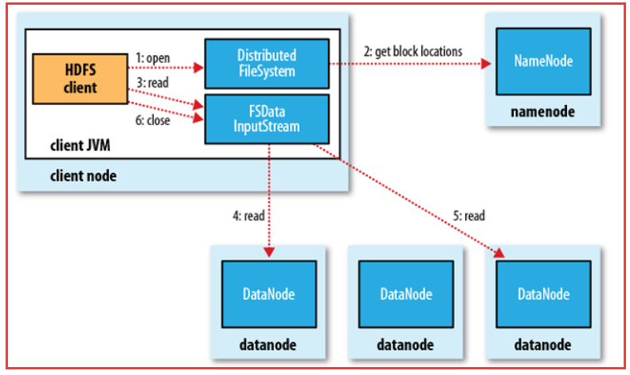
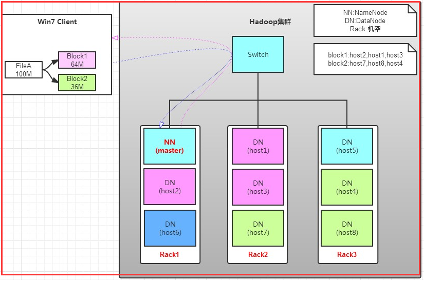

> 参考原文：<https://www.cnblogs.com/zhangyinhua/p/7681059.html>
>

HDFS 的存储原理，无非就是读操作和写操作。

### HDFS 的读取过程



1. 客户端通过调用 FileSystem 对象的 `open()` 来读取希望打开的文件。对于 HDFS 来说，这个对象是分布式文件系统的一个实例
2. DistributedFileSystem 通过 RPC 来调用 Namenode，以确定文件的开头部分的块位置。对于每一个块，Namenode 返回具有该块副本的 Datanode 的地址

- 这些 Datanode 的地址是根据它们与 Client 的距离来排序（根据网络集群的拓扑）。如果该 Client 本身就是一个 Datanode ，便从本地 Datanode 中读取
- DistributedFileSystem 返回一个 FSDataInputStream 对象给 Client 读取数据，FSDataInputStream 转而包装了一个 DFSInputStream 对象

3. 接着 Client 对这个输入流调用 `read()` 。存储着文件开头部分的块的 Datanode 的地址 DFSInputStream 随即与这些块最近的 Datanode 相连接

4. 通过在数据流中反复调用 `read()`，数据会从 Datanode 返回 client

5. 到达块的末端时，DFSInputStream 会关闭与 Datanode 间的联系，然后为下一个块找到最佳的 Datanode。Client 端只需要读取一个连续的流，这些对于 Client 来说都是透明的

6. 在读取的时候，如果 Client 与 Datanode 通信时遇到一个错误，那么它就会去尝试对这个块来说下一个最近的块（冗余备份的块）。它也会记住那个故障节点的 Datanode，以保证不会再对之后的块进行徒劳无益的尝试

   - Client 也会确认 Datanode 发来的数据的校验和。如果发现一个损坏的块，它就会在 Client 试图从别的 Datanode 中读取一个块的副本之前报告给 Namenode

7. 这个设计的一个重点是，Client 直接联系 Datanode 去检索数据，并被 Namenode 指引到块中最好的 Datanode。因为数据流在此集群中是在所有datanode分散进行的

所以这种设计能使HDFS可扩展到最大的并发client数量。同时，Namenode只不过提供块的位置请求（存储在内存中，十分高效），不是提供数据。否则如果客户端数量增长，Namenode就会快速成为一个“瓶颈”。

### HDFS 的写入过程


1. 客户端通过在 DistributedFileSystem 中调用 `create()` 来创建文件
2. DistributedFileSystem 使用 RPC 去调用 Namenode，在文件系统的命名空间创一个新的文件，没有块与之相联系

   - Namenode 执行各种不同的检查（比如：文件存不存在，有没有权限去写，能不能存的下这个文件）以确保这个文件不会已经存在，并且在 Client 有可以创建文件的适当的许可
   - 如果检查通过，Namenode 就会生成一个新的文件记录；否则，文件创建失败并向 Client 抛出一个 IOException 异常
   - 分布式文件系统返回一个文件系统数据输出流，让 Client开始写入数据。就像读取事件一样，文件系统数据输出流控制一个 DFSOutputStream，负责处理 Datanode 和 Namenode 之间的通信
3. 在 Client 写入数据时，DFSOutputStream 将它分成一个个的包，写入内部的队列，成为数据队列。数据队列随数据流流动，数据流的责任是根据适合的 Datanode 的列表要求这些节点为副本分配新的块。
   - 这个数据节点的列表形成一个管线——假设副本数是3，所以有3个节点在管线中。
4. 数据流将包分流给管线中第一个的 Datanode，这个节点会存储包并且发送给管线中的第二个 Datanode。同样地，第二个Datanode 存储包并且传给管线中的第三个数据节点
5. DFSOutputStream 也有一个内部的包队列来等待 Datanode 收到确认，成为确认队列。一个包只有在被管线中所有的节点确认后才会被移除出确认队列。如果在有数据写入期间，Datanode 发生故障，则会执行下面的操作，当然这对写入数据的 Client 而言是透明的。首先管线被关闭，确认队列中的任何包都会被添加回数据队列的前面，以确保故障节点下游的 Datanode 不会漏掉任意一个包。为存储在另一正常 Datanode 的当前数据块制定一个新的标识，并将该标识传给 Namenode，以便故障节点Datanode 在恢复后可以删除存储的部分数据块。从管线中删除故障数据节点并且把余下的数据块写入管线中的两个正常的Datanode。Namenode 注意到块复本量不足时，会在另一个节点上创建一个新的复本。后续的数据块继续正常接收处理。只要`dfs.replication.min` 的副本（默认是1）被写入，写操作就是成功的，并且这个块会在集群中被异步复制，直到其满足目标副本数（dfs.replication 默认值为3）
6. Client完成数据的写入后，就会在流中调用`close()`
7. 在向 Namenode 节点发送完消息之前，此方法会将余下的所有包放入 Datanode 管线并等待确认
   - Namenode节点已经知道文件由哪些块组成（通过 Data streamer 询问块分配），所以它只需在返回成功前等待块进行最小量的复制。

8. 补充说明——复本的布局：Hadoop的默认布局策略是在运行客户端的节点上放第1个复本（如果客户端运行在集群之外，就随机选择一个节点，不过系统会避免挑选那些存储太满或太忙的节点。）

第2个复本放在与第1个复本不同且随机另外选择的机架的节点上（离架）。第3个复本与第2个复本放在相同的机架，且随机选择另一个节点。其他复本放在集群中随机的节点上，不过系统会尽量避免相同的机架放太多复本。

## 通过实例说明HDFS的读写操作

### 写入操作

　　

- **前提**：
  - 有一个文件FileA，100M大小。Client将FileA写入到HDFS上
  - HDFS按默认配置
  - HDFS分布在三个机架上Rack1，Rack2，Rack3
- **步骤**：
  1. Client将FileA按64M分块。分成两块，block1和Block2
  2. Client向nameNode发送写数据请求，如图蓝色虚线①------>。
  3. NameNode节点，记录block信息。并返回可用的DataNode，如粉色虚线②--------->。
     　　Block1: host2,host1,host3
        　　Block2: host7,host8,host4
        　　原理：
        　　　　NameNode具有RackAware机架感知功能，这个可以配置。
        　　　　若client为DataNode节点，那存储block时，规则为：副本1，同client的节点上；副本2，不同机架节点上；副本3，同第二个副本机架的另一个节点上；其他副本随机挑选。
        　　　　若client不为DataNode节点，那存储block时，规则为：副本1，随机选择一个节点上；副本2，不同副本1，机架上；副本3，同副本2相同的另一个节点上；其他副本随机挑选。
  4. client向DataNode发送block1；发送过程是以流式写入。
     　　流式写入过程：
        　　　　第一步：将64M的block1按64k的package划分;
        　　　　第二步：然后将第一个package发送给host2;
        　　　　第三步：host2接收完后，将第一个package发送给host1，同时client想host2发送第二个package；
        　　　　第四步：host1接收完第一个package后，发送给host3，同时接收host2发来的第二个package。
        　　　　第五步：以此类推，如图红线实线所示，直到将block1发送完毕。
        　　　　第六步：host2,host1,host3向NameNode，host2向Client发送通知，说“消息发送完了”。如图粉红颜色实线所示。
        　　　　第七步：client收到host2发来的消息后，向namenode发送消息，说我写完了。这样就完成了。如图黄色粗实线
        　　　　第八步：发送完block1后，再向host7，host8，host4发送block2，如图蓝色实线所示。
        　　　　第九步：发送完block2后，host7,host8,host4向NameNode，host7向Client发送通知，如图浅绿色实线所示。
        　　　　第十步：client向NameNode发送消息，说我写完了，如图黄色粗实线。。。这样就完毕了。

- **分析**：

　　　　通过写过程，我们可以了解到：
　　　　　　1）写1T文件，我们需要3T的存储，3T的网络流量带宽。
　　　　　　2）在执行读或写的过程中，NameNode和DataNode通过HeartBeat进行保存通信，确定DataNode活着。
　　　　　　　　如果发现DataNode死掉了，就将死掉的DataNode上的数据，放到其他节点去。读取时，要读其他节点去。
　　　　　　3）挂掉一个节点，没关系，还有其他节点可以备份；甚至，挂掉某一个机架，也没关系；其他机架上，也有备份。

### 读取操作



读操作就简单一些了，如图所示，client要从datanode上，读取FileA。而FileA由block1和block2组成。 

那么，读操作流程为：

1. client向namenode发送读请求

2. namenode查看Metadata信息，返回fileA的block的位置

   ```txt
block1:host2,host1,host3
   block2:host7,host8,host4
   ```
   
3. block的位置是有先后顺序的，先读block1，再读block2。而且block1去host2上读取；然后block2，去host7上读取；

上面例子中，client位于机架外，那么如果client位于机架内某个DataNode上，例如,client是host6。那么读取的时候，遵循的规律是：优选读取本机架上的数据。