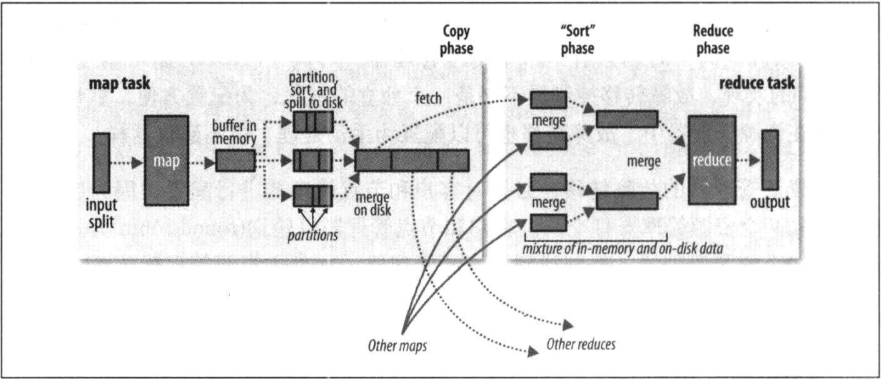

> MapReduce 确保每个 reducer 的输入都是按键排序的。系统执行排序、将 map 输出作为输入传给 reducer 的过程称为 ***shuffle***。

## map 端

map 函数开始产生输出时，并不是直接将它写到磁盘。它利用缓冲的方式写到内存并处于效率的考虑进行预排序。

每个 map 任务都有一个环形内存缓冲区用于存储任务输出。在默认情况下，缓冲区的大小为 100MB，这个值可以通过改变 `mapreduce.task.io.sort.mb` 属性来调整。一旦缓冲内容达到阈值（`mapreduce.map.sort.spill.percent`，默认为 0.8 或 80%），一个后台线程便开始把内容溢出（spill）到磁盘。在溢出写到磁盘过程中，map 输出继续写到缓冲区，但如果在此期间缓冲区被填满，map 会被阻塞直到写磁盘过程完成。溢出写过程按轮询方式将缓冲区中的内容写到 `mapreduce.cluster.local.dir` 属性在作业特定子目录下指定的目录中。

在写磁盘之前，线程首先根据数据最终要传的 reducer 把数据划分成相应的分区（partition）。在每个分区中，后台线程按键进行内存中排序，如果有一个 combiner 函数，它就在排序后的输出上运行。运行 combiner 函数使得 map 输出结果更紧凑，因此减少写到磁盘的数据和传递给 reducer 的数据。

每次内存缓冲区达到溢出阈值，就会创建一个溢出文件（spill file），因此在 map 任务写完其最后一个输出记录之后，会有几个溢出文件。在任务完成之前，溢出文件被合并成一个已分区且已排序的输出文件。配置属性 `mapreduce.task.io.sort.factor` 控制着一次最多能合并多少流，默认值是 10。

如果至少存在 3 个溢出文件（通过 `mapreduce.map.combine.minspills` 属性设置）时，则 combiner 就会在输出文件写到磁盘之前再次运行。如果只有 1 或 2 个溢出文件，那么由于 map 输出规模减少，因而不值得调用 combiner 带来的开销，因此不会为该 map 输出再次运行 combiner。

在将压缩 map 输出写到磁盘的过程中对它进行压缩往往是个很好的主意，因为这样会让写磁盘的速度更快，节约磁盘的空间，并且减少传给 reducer 的数据量。在默认情况下，输出是不压缩的，但只要将 `mapreduce.map.output.compress` 设置为 true，就能启用此功能。使用的压缩库由 `mapreduce.map.output.compress.codec` 指定。

reducer 通过 HTTP 得到输出文件的分区。用于文件分区的工作线程的数量由任务的 `mapreduce.shuffle.max.threads` 属性控制，此设置针对的是每一个节点管理器，而不是针对每个 map 任务。默认值 0 将最大线程数设置为机器中处理数量的两倍。

## reduce 端

TODO

