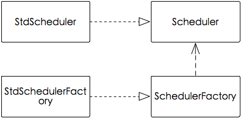
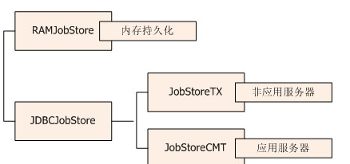

# Quartz 定时任务

> Java领域的一个任务调度库，为开发者提供了丰富的任务调度的功能。

## 简介

quartz，即石英的意思，隐喻如石英表般对时间的准确把握。

quartz是一个由java编写的任务调度库，由OpenSymphony组织开源出来。

quartz的核心作用是使任务调度变得丰富、高效、安全，开发者只需要调几个quartz接口并做简单的配置就可以实现。

quartz号称能够同时对上万个任务进行调度，拥有丰富的功能特性，包括任务调度、任务持久化、可集群化、插件等。目前最新版本是2.2.3，从[github](https://github.com/quartz-scheduler/quartz)上看，2.2.4已在开发中。

## Job(任务)

Job由若干个`class`和`interfact`实现

### Job(接口)

Quartz定时任务要实现Job接口，Job只有一个`execute(JobExecutionContext context)`方法，JobExecutionContext保存了job的上下文信息，比如绑定了是哪个trigger。Job实现类必须重写`execute（）`,执行Job实际上就是运行`execute()`。

### JobDetailImpl类/JobDetail接口

`JobDetailImpl类`实现了`JobDetail接口`，用来描述一个Job，定义了Job所有属性及其get/set方法。

| 属性名        | 说明                                                                                                                                                                |
| :------------ | :------------------------------------------------------------------------------------------------------------------------------------------------------------------ |
| class         | 必须是Job实现类，用来绑定一个具体Job                                                                                                                                |
| name          | Job名称，如果未指定，会自动分配一个唯一名称。所有Job都必须拥有一个唯一name，如果两个Job的name重复，则只有最前面的Job能被调度                                        |
| group         | Job所属的组名                                                                                                                                                       |
| description   | Job描述                                                                                                                                                             |
| durability    | 是否持久化。如果Job设置为非持久化，当没有活跃的trigger与之关联的时候，Job会自动从scheduler中删除，也就是说，非持久Job的生命周期是由trigger的存在与否决定的          |
| shouldRecover | 是否可恢复。如果Job设置为可恢复，一旦Job执行时scheduler重启后，该job会被重新执行                                                                                    |
| jobDataMap    | 用户可以把任意k/v数据存入jobDataMap，实现Job属性的无限扩展，执行Job时可以使用这些属性数据。此属性的类型是JobDataMap，实现了Serializable接口，可做跨平台的序列化传输 |

### JobBuilder类

```java
// 创建任务
JobDetail jobDetail = JobBuilder.newJob(JobImpl.class).withIdentity("myJob", "jobGroup").build();
```

JobBuilder类的作用：接收Job实现类，生成JobDetail实例，默认生成JobDetailImpl实例。

这里运用了建造者模式：Job实现类相当于Product；JobDetail相当于Builder，拥有Job的各种属性及其get/set方法；JobBuilder相当于Director，可为一个Job组装各种属性。

## trigger（触发器）

### Trigger接口

`SimpleTriggerImpl类`实现了`SimpleTrigger接口`，`SimpleTrigger接口`继承了`Trigger接口`，它们表示触发器，用来保存触发job的策略，比如每隔几秒触发job。实际上，quartz有两大触发器：`SimpleTrigger`和`CronTrigger`。

trigger所有属性：

| 属性名             | 属性类型      | 说明                                                                                                                       |
| :----------------- | :------------ | :------------------------------------------------------------------------------------------------------------------------- |
| name               | ALL           | trigger名称                                                                                                                |
| group              | ALL           | trigger所属的组名                                                                                                          |
| description        | ALL           | trigger描述                                                                                                                |
| calendarName       | ALL           | 日历名称，指定使用哪个Calendar类，经常用来从trigger的调度计划中排除某些时间段                                              |
| misfireInstruction | ALL           | 错过Job（未在指定时间执行的Job）的处理侧率，默认为`MISFIRE_INSTRUCTION_SMART_POLICY`                                       |
| priority           | ALL           | 优先级，默认为`5`。当多个trigger同时触发Job时，线程池可能不够用，此时根据优先级来决定谁先触发                              |
| jobDataMap         | ALL           | 同Job的jobMapData，加入Job和Trigger的jobDataMap有同名的key，通过`getMergedJobDataMap()`获取的jobDataMap，将以trigger的为准 |
| startTime          | ALL           | 触发开始时间，默认为当前时间。决定什么时间开始触发Job                                                                      |
| endTime            | ALL           | 触发结束时间。决定什么时间停止触发Job                                                                                      |
| nextFireTime       | SimpleTrigger | 下一次触发Job的时间                                                                                                        |
| previousFireTime   | SimpleTrigger | 上一次触发job的时间                                                                                                        |
| repeatCount        | SimpleTrigger | 需触发的总次数                                                                                                             |
| timesTriggered     | SimpleTrigger | 已经触发过的次数                                                                                                           |
| repeatInterval     | SimpleTrigger | 触发间隔时间                                                                                                               |

### TriggerBuilder类

```java
// 创建触发器
// withIntervalInSeconds(2)表示每隔2s执行任务
Date triggerDate = new Date();
SimpleScheduleBuilder schedBuilder = SimpleScheduleBuilder.simpleSchedule().withIntervalInSeconds(2).repeatForever();
TriggerBuilder<Trigger> triggerBuilder  = TriggerBuilder.newTrigger().withIdentity("myTrigger", "triggerGroup");
Trigger trigger = triggerBuilder.startAt(triggerDate).withSchedule(schedBuilder).build();
```

由TiggerBuilder类的作用：生成Trigger实例，默认生成SimpleTriggerImpl实例。同JobBuilder一样，这里也运用了建造者模式

## scheduler（调度器）

scheduler主要由`StdScheduler类`、`Scheduler接口`、`StdSchedulerFactory类`、`SchedulerFactory接口`、`QuartzScheduler类`实现，它们的关系见下面UML图。



```java
// 创建调度器
SchedulerFactory schedulerFactory = new StdSchedulerFactory();
Scheduler scheduler = schedulerFactory.getScheduler();

// ......

// 将任务及其触发器放入调度器
scheduler.scheduleJob(jobDetail, trigger);
// 调度器开始调度任务
scheduler.start();
```

由示例可以看出来这里运用了工厂模式，通过factory类(StdSchedulerFactory)生产出scheduler实例。

- ```
  StdSchedulerFactory.getScheduler()
  ```

  源码分析

  ```java
  public Scheduler getScheduler() throws SchedulerException {
      // 读取quartz配置文件，未指定则顺序遍历各个path下的quartz.properties文件
      // 解析出quartz配置内容和环境变量，存入PropertiesParser对象
      // PropertiesParser组合了Properties（继承Hashtable），定义了一系列对Properties的操作方法，比如getPropertyGroup()批量获取相同前缀的配置。配置内容和环境变量存放在Properties成员变量中
      if (cfg == null) {
          initialize();
      }
      // 获取调度器池，采用了单例模式
      // 其实，调度器池的核心变量就是一个hashmap，每个元素key是scheduler名，value是scheduler实例
      // getInstance()用synchronized防止并发创建
      SchedulerRepository schedRep = SchedulerRepository.getInstance();
  
      // 从调度器池中取出当前配置所用的调度器
      Scheduler sched = schedRep.lookup(getSchedulerName());
  
      //......
  
      // 如果调度器池中没有当前配置的调度器，则实例化一个调度器，主要动作包括：
      // 1）初始化threadPool(线程池)：开发者可以通过org.quartz.threadPool.class配置指定使用哪个线程池类，比如SimpleThreadPool。先class load线程池类，接着动态生成线程池实例bean，然后通过反射，使用setXXX()方法将以org.quartz.threadPool开头的配置内容赋值给bean成员变量；
      // 2）初始化jobStore(任务存储方式)：开发者可以通过org.quartz.jobStore.class配置指定使用哪个任务存储类，比如RAMJobStore。先class load任务存储类，接着动态生成实例bean，然后通过反射，使用setXXX()方法将以org.quartz.jobStore开头的配置内容赋值给bean成员变量；
      // 3）初始化dataSource(数据源)：开发者可以通过org.quartz.dataSource配置指定数据源详情，比如哪个数据库、账号、密码等。jobStore要指定为JDBCJobStore，dataSource才会有效；
      // 4）初始化其他配置：包括SchedulerPlugins、JobListeners、TriggerListeners等；
      // 5）初始化threadExecutor(线程执行器)：默认为DefaultThreadExecutor；
      // 6）创建工作线程：根据配置创建N个工作thread，执行start()启动thread，并将N个thread顺序add进threadPool实例的空闲线程列表availWorkers中；
      // 7）创建调度器线程：创建QuartzSchedulerThread实例，并通过threadExecutor.execute(实例)启动调度器线程；
      // 8）创建调度器：创建StdScheduler实例，将上面所有配置和引用组合进实例中，并将实例存入调度器池中
      sched = instantiate();
  
      return sched;
  }
  ```

- 初始化jobStore：表示使用哪种方式存储scheduler相关数据。quartz有两种jobStore：`RAMJobStore`和`JDBCJobStore`。RAMJobStore把数据存入内存，性能最高，配置也简单，但缺点是系统挂了数据无法恢复。JDBCJobStore保存数据到数据库，保证数据的可恢复性，但性能较差且配置复杂。 

- ```
  QuartzScheduler.schedulerJobDetail(JobDetail,Trigger)
  ```

  源码

  ```java
  public Date scheduleJob(JobDetail jobDetail,
          Trigger trigger) throws SchedulerException {
      // 检查调度器是否开启，如果关闭则throw异常到上层
      validateState();
      // ......
      // 获取trigger首次触发job的时间，以此时间为起点，每隔一段指定的时间触发job
      Date ft = trig.computeFirstFireTime(cal);
  
      if (ft == null) {
          throw new SchedulerException(
                  "Based on configured schedule, the given trigger '" + trigger.getKey() + "' will never fire.");
      }
  
      // 把job和trigger注册进调度器的jobStore
      resources.getJobStore().storeJobAndTrigger(jobDetail, trig);
      // 通知job监听者
      notifySchedulerListenersJobAdded(jobDetail);
      // 通知调度器线程
      notifySchedulerThread(trigger.getNextFireTime().getTime());
      // 通知trigger监听者
      notifySchedulerListenersSchduled(trigger);
  
      return ft;
  }
  ```

```java
QuartzScheduler.start()
```

  源码

```java
public void start() throws SchedulerException {
    // ......
    // 这句最关键，作用是使调度器线程跳出一个无限循环，开始轮询所有trigger触发job
    schedThread.togglePause(false);
    ......
}
```

## F&Q

### 如何采用多线程进行调度

- QuartzSchedulerThread

```java
// 调度器线程一旦启动，将一直运行此方法
public void run() {
    // while()无限循环，每次循环取出时间将到的trigger，触发对应的job，直到调度器线程被关闭
    // halted是一个AtomicBoolean类变量，有个volatile int变量value，其get()方法仅仅简单的一句return value != 0，get()返回结果表示调度器线程是否开关
    // volatile修饰的变量，存取必须走内存，不能通过cpu缓存，这样一来get总能获得set的最新真实值，因此volatile变量适合用来存放简单的状态信息
    while (!halted.get()) {
        try {
            // check if we're supposed to pause...
            // sigLock是个Object对象，被用于加锁同步
            // 需要用到wait()，必须加到synchronized块内
            synchronized (sigLock) {
                while (paused && !halted.get()) {
                    try {
                        // wait until togglePause(false) is called...
                        // 这里会不断循环等待，直到QuartzScheduler.start()调用了togglePause(false)
                        // 调用wait()，调度器线程进入休眠状态，同时sigLock锁被释放
                        // togglePause(false)获得sigLock锁，将paused置为false，使调度器线程能够退出此循环，同时执行sigLock.notifyAll()唤醒调度器线程
                        sigLock.wait(1000L);
                    } catch (InterruptedException ignore) {}
                }
                ......
            }
            ......
            // 如果线程池中的工作线程个数 > 0
            if(availThreadCount > 0) {
                ......
                // 获取马上到时间的trigger
                // 允许取出的trigger个数不能超过一个阀值，这个阀值是线程池个数与org.quartz.scheduler.batchTriggerAcquisitionMaxCount配置值间的最小者
                triggers = qsRsrcs.getJobStore().acquireNextTriggers(
                    now + idleWaitTime, Math.min(availThreadCount, qsRsrcs.getMaxBatchSize()), qsRsrcs.getBatchTimeWindow());
                ......
                // 执行与trigger绑定的job
                // shell是JobRunShell对象，实现了Runnable接口
                // SimpleThreadPool.runInThread(Runnable)从线程池空闲列表中取出一个工作线程
                // 工作线程执行WorkerThread.run(Runnable)，详见下方WorkerThread的讲解
                if (qsRsrcs.getThreadPool().runInThread(shell) == false) { ...... }
            } else {......}
            ......
        } catch(RuntimeException re) {......}
    } // while (!halted)
    ......
}
```

- WorkerThread

```java
public void run(Runnable newRunnable) {
    synchronized(lock) {
        if(runnable != null) {
            throw new IllegalStateException("Already running a Runnable!");
        }

        runnable = newRunnable;
        lock.notifyAll();
    }
}

// 工作线程一旦启动，将一直运行此方法
@Override
public void run() {
    boolean ran = false;

    // 工作线程一直循环等待job，直到线程被关闭，原理同QuartzSchedulerThread.run()中的halted.get()
    while (run.get()) {
        try {
            // 原理同QuartzSchedulerThread.run()中的synchronized (sigLock)
            // 锁住lock，不断循环等待job，当job要被执行时，WorkerThread.run(Runnable)被调用，job运行环境被赋值给runnable
            synchronized(lock) {
                while (runnable == null && run.get()) {
                    lock.wait(500);
                }
                // 开始执行job
                if (runnable != null) {
                    ran = true;
                    // runnable.run()将触发运行job实现类（比如JobImpl.execute()）
                    runnable.run();
                }
            }
        } catch (InterruptedException unblock) {
        //......
        }
    }
    //......
}
```

