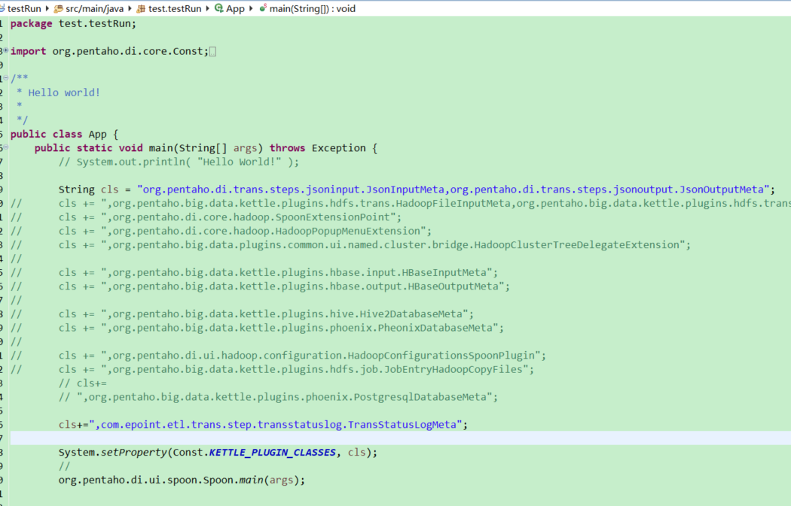

[TOC]

## 架构

[todo]

## 插件工程搭建

### 1、创建一个插件工程，如 `testdemo`

### 2、maven 依赖引用如下:

```xml
<project xmlns="http://maven.apache.org/POM/4.0.0"
	xmlns:xsi="http://www.w3.org/2001/XMLSchema-instance"
	xsi:schemaLocation="http://maven.apache.org/POM/4.0.0 http://maven.apache.org/xsd/maven-4.0.0.xsd">
	<modelVersion>4.0.0</modelVersion>
	<groupId>com.epoint.bigdata</groupId>
	<artifactId>testdemo</artifactId>

	<parent>
		<groupId>org.pentaho.di.plugins</groupId>
		<artifactId>pdi-plugins</artifactId>
		<version>8.2.0.0-342</version>
	</parent>

	<!-- Kettle dependencies -->
	<dependencies>
		<dependency>
			<groupId>pentaho-kettle</groupId>
			<artifactId>kettle-core</artifactId>
			<version>${project.version}</version>
		</dependency>
		<dependency>
			<groupId>pentaho-kettle</groupId>
			<artifactId>kettle-engine</artifactId>
			<version>${project.version}</version>
		</dependency>
		<dependency>
			<groupId>pentaho-kettle</groupId>
			<artifactId>kettle-ui-swt</artifactId>
			<version>${project.version}</version>
		</dependency>
	</dependencies>
</project>
```

### 3、编写组件

Kettle步骤/节点是由 4 个类构成的，每一个类都有其特定的目的及所扮演的角色。

- `TestdemoStep`：该步骤实现了 StepInterface 接口，在转换运行时，它的实例将是数据实际处理的位置。每一个执行线程都表示一个此类的实例
- `TestdemoStepData`：数据类用来存储数据，当插件执行时，对于每个执行的线程都是唯一的。执行时里面存储的东西主要包括数据库连接、文件句柄、缓存等等其他东西
- `TestdemoStepMeta`：元数据类实现了StepMetaInterface接口；它的职责是保存和序列化特定步骤实例的配置
- `TestdemoStepDialog`：对话框类实现了该步骤与用户交互的界面，它显示一对话框，通过对话框用户可以自己的喜好设定步骤的操作

#### StepInterface的实现

**父类：**`BaseStep`

**实现类名：`TestDemoStep`**

> **1、必须要有构造函数**

```java
/**
*
* 描述：类的构造函数通常直接把参数传递给BaseStep父类。由父类里的方法来构造对象，然后可以直接使用类似transMeta这样的对象
*
* @param stepMeta
* @param stepDataInterface
* @param copyNr
* @param transMeta
* @param trans
*/
public TestdemoStep(StepMeta stepMeta, StepDataInterface stepDataInterface, int copyNr, TransMeta transMeta,Trans trans) {
	super(stepMeta, stepDataInterface, copyNr, transMeta, trans);
}
```

> **2、实现 `processRow`方法**

```java
@Override
public boolean processRow(StepMetaInterface smi, StepDataInterface sdi) throws KettleException {

    TestdemoStepMeta meta = (TestdemoStepMeta) smi;
    TestdemoStepData data = (TestdemoStepData) sdi;

    /**
    * getRow() 方法从上一个步骤获取一行数据，如果没有更多要获取的数据行，这个方法就会返回null。
    * 如果前面的步骤不能及时提供数据，这个方法就会阻塞，直到有可用的数据行。这样这个步骤的速度就会降低，也会影响其他步骤的速度
    */
    Object[] row = getRow();
    if (null == row) {
        /**
        * setOutputDone()方法用来通知其他步骤，本步骤已经没有输出数据行。
        * 下一个步骤如果再调用getRow()方法就会返回null，转换也不再调用processRow()方法。
        */
        setOutputDone();
        return false;
    }

    if (first) {
        first = false;

        /**
        * 从性能上考虑，getRow()方法不提供数据行的元数据，只提供上个步骤输出的数据。
        * 可以使用getInputRowMeta()方法获取元数据，元数据只获取一次即可，所以在first代码块里获取元数据。
        * 如果要把数据传到下一个步骤，要使用putRow()方法。除了输出数据，还要输出RowMetaInterface元数据。
        * 第一行使用clone()方法把输入行的元数据结构复制给输出行。
        * 输出行的元数据结构是在输入行的基础上增加一个字段，但构造输出行的元数据结构只能构造一次，因为所有输出数据行的结构都是一样的，产生了输出行以后，元数据结构就不能再变化。
        * 所以输出行的元数据结构在first代码块里构造。first是一个内部成员，first代码块里的代码只在处理第一行数据时执行。
        * 下面代码的最后一行，给输出数据增加了一个字段。
        */
        data.outputRowMeta = getInputRowMeta().clone();
        meta.getFields(data.outputRowMeta, getStepname(), null, null, this);
    }

    /**
    *
    * 下面的代码，把数据写入输出流。
    * 从性能角度考虑，数据行实现就是Java数组。
    * 为了开发方便，可以使用RowDataUtil类提供的一些静态方法来操作数据。
    * 使用RowDatautil静态方法复制数据，还可以提高性能。
    */

    String value = "Hello, world!";
    Object[] outputRow = RowDataUtil.addValueData(row, getInputRowMeta().size(), value);
    putRow(data.outputRowMeta, outputRow);

	return true;
}
```

#### StepMetaInterface的实现

**父类：**`BaseStepMeta`

**实现类名：`TestDemoStepMeta`**

> **1、给实现类添加 `@Step`注解**

```java
/**
 * 注解 @Step 用来通知Kettle的插件注册系统：这个类是一个步骤类型的插件。
 * 在注解中可以指定插件的ID、图标、国际化的包、本地化的名称、类别、描述；其中后三项式资源文件里的 Key，需要在资源文件里设置真正的值。
 * i18nPackageName 指定了资源文件的包名
 */
@Step(id = "Testdemo", // 插件ID，用来唯一标识一个插件
		image = "Testdemo.svg", //指定了插件的图标。需要32*32像素的PNG文件，可以使用透明央视
		i18nPackageName = "com.epoint.bigdata.testdemo.TestdemoStep", //注：包名不可随意选取，需要时stepinterface接口的实现类，同时插件包的i18n放在此包的message下
		name = "Testdemo.Name", //
		description = "Testdemo.Description" //
		,categoryDescription = "i18n:org.pentaho.di.trans.step:BaseStep.Category.Utility"// 指定分类，如果指定了不存在的分类，Spoon会创建这个分类，并在Spoon的分类树的最上方显示这个分类
)
```

> **2、`getStep()`方法的是实现**

```java
/**
* 创建一个实现了 {@link StepInterface} 接口的类 getStep、getStepData 和 getDialogClassName
* 方法提供了与这个步骤里其它三个接口之间的桥梁 这个接口里还定义了几个方法来说明这四个接口如何结合到一起。 String
* getDialogClassName():用来描述实现了StepDialogInterace接口的对话框类的名字。如果这个方法返回了null，调用类会根据实现了StepMetaInterface接口的类的类名和包名来自动生成对话框类的名字。
* StepInterface getStep():创建一个实现了StepInterface接口的类。 StepInterface
* getStepData():创建一个实现了StepDataInterface接口的类。
*/
@Override
public StepInterface getStep(StepMeta stepMeta, StepDataInterface stepDataInterface, int copyNr,
                             TransMeta transMeta, Trans trans) {
    
    return new TestdemoStep(stepMeta, stepDataInterface, copyNr, transMeta, trans);
}
```

> **3、定义Dialog中保存的元数据**

```java
private String fieldName;

public String getFieldName() {
	return fieldName;
}

public void setFieldName(String fieldName) {
	this.fieldName = fieldName;
}
```

> **元数据的序列化和反序列化**

```java
/**
	 * 下面的四个方法loadXML()、getXML()、readRep()和saveRep()把元数据保存到XML文件或资源库里，
	 * 或者从XML文件或资源库读取元数据。保存到文件的方法利用了像XStream（http://xstream.codehaus.org）这
	 * 样的XML串行化技术。
	 */

/**
	 * 从 xml 中反序列化
	 */
@Override
public void loadXML(Node stepnode, List<DatabaseMeta> databases, IMetaStore metaStore) throws KettleXMLException {
    fieldName = XMLHandler.getTagValue(stepnode, "field_name");
}

@Override
public String getXML() throws KettleException {
    StringBuilder xml = new StringBuilder();
    xml.append(XMLHandler.addTagValue("field_name", fieldName));
    return xml.toString();
}

/**
	 * 从资源库反序列化
	 */
@Override
public void readRep(Repository rep, ObjectId id_step, List<DatabaseMeta> databases, Map<String, Counter> counters)
    throws KettleException {
    fieldName = rep.getStepAttributeString(id_step, "field_name");
}

@Override
public void saveRep(Repository rep, ObjectId id_transformation, ObjectId id_step) throws KettleException {
    rep.saveStepAttribute(id_transformation, id_step, "field_name", fieldName);
}
```

#### StepDataInterface的实现

**父类：**`BaseStepData`

**实现类名：`TestDemoStepData`**

[TODO]

#### StepDialogInterface的实现

**父类：**`BaseStepDialog`

**实现类名：`TestDemoStepDialog`**

> **1、必须提供构造函数**

```java
private TestdemoStepMeta input;

public TestdemoStepDialog(Shell parent, BaseStepMeta baseStepMeta, TransMeta transMeta, String stepname) {
	// 初始化元数据对象以及步骤对话框的父类
	super(parent, baseStepMeta, transMeta, stepname);
	input = (TestdemoStepMeta) baseStepMeta;
}
```

> **2、实现 `open()` 方法**


## 接口类

### `StepMetaInterface`

接口 `org.pentaho.di.trans.step.StepMetaInterface` 负责步骤里所有和元数据相关的任务。和元数据相关的工作包括：

- 元数据和XML(或资源库)之间的序列化和反序列化
  - `getXML()` 和 `loadXML()`
  - `saveRep()` 和 `readRep()`
- 描述输出字段 
  - `getFields()`
- 检验元数据是否正确
  - `Check()`
- 获取步骤相应的要SQL语句，使步骤可以正确运行
  - `getSQLStatements()`
- 给元数据设置默认值
  - `setDefault()`
- 完成对数据库的影响分析
  - `analyseImpact()`
- 描述各类输入和输出流
  - `getStepIOMeta()`
  - `searchInfoAndTargetSteps()`
  - `handleStreamSelection()`
  - `getOptionalStreams()`
  - `resetStepIoMeta()`
- 导出元数据资源
  - `exportResources()`
  - `getResourceDependencies()`
- 描述使用的库
  - `getUsedLibraries()`
- 描述使用的数据库连接
  - `getUsedDatabaseConnections()`
- 描述这个步骤需要的字段（通常是一个数据库表）
  - `getRequiredFields()`
- 描述步骤是否具有某些功能
  - `supportsErrorHandling()`
  - `excludeFromRowLayoutVerification()`
  - `excludeFromCopyDistributeVerification()`

#### 值的元数据（Value Metadata）

值的元数据使用 ValueMetaInterface 接口描述数据流里的一个字段。这个接口里定义了字段的名称、数据类型、长度、精度等等。

示例：

```java
ValueMetaInterface dataMeta = new ValueMeta("birthday", ValueMetaInterface.TYPE_DATE);
```

这个接口也负责转换数据格式。建议使用 ValueMetaInterface 接口来完成所有数据转换的工作。例如，日期类型的数据，如果想要把它转换为 dateMeta 对象里定义的字符串格式，可以用下面的代码：

```java
//java.util.Date birthdate
String birthDateString = dateMeta.getString(birthdate);
```

ValueMeta 类负责转换。因为有 ValueMetaInterface 进行数据类型的转换，所以不用再去做额外的数据类型转换的工作。

使用 ValueMetaInterface 接口时还要注意数据对象是否为 null。从上一个步骤可以接收到一个数据对象和一个描述数据对象的 ValueMetaInterface 对象。

要保证传给 ValueMetaInterface 对象的数据是在元数据里定义的数据类型。

Kettle元数据类型和Java里数据类型的对应关系：

<table>
    <tr>
        <th>Value Meta Type</th>
        <th>Java Class</th>
    </tr>
    <tr>
        <td>ValueMetaInterface.TYPE_STRING</td>
        <td>Java.lang.String</td>
    </tr>
    <tr>
        <td>ValueMetaInterface.TYPE_DATE</td>
        <td>Java.util.Date</td>
    </tr>
    <tr>
        <td>ValueMetaInterface.TYPE_BOOLEAN</td>
        <td>Java.lang.Boolean</td>
    </tr>
	<tr>
        <td>ValueMetaInterface.TYPE_NUMBER</td>
        <td>Java.lang.Double</td>
    </tr>
	<tr>
        <td>ValueMetaInterface.TYPE_INTEGER</td>
        <td>Java.lang.Long</td>
    </tr>
	<tr>
        <td>ValueMetaInterface.TYPE_BIGNUMBER</td>
        <td>Java.math.BigDecimal</td>
    </tr>
	<tr>
        <td>ValueMetaInterface.TYPE_BINARY</td>
        <td>Byte[]</td>
    </tr>
</table>

#### 行的元数据（Row Metadata）

行的元数据使用 RowMetaInterface 接口来描述数据行的元数据，而不是一个列的元数据。实际上，RowMetaInterface 的类里包含了一组 ValueMetaInterface。另外还包括了一些方法来操作行元数据，例如查询值、检查值是否存在、替换值的元数据等。

行的元数据里唯一的规则就是一行里的列的列的名字必须唯一。当添加了一个新列时，如果新列的名字和已有列的名字相同，列名后面会自动加上 `_2`后缀。如果再加一个同名的列会自动加上`_3`后缀。

因为在步骤里通常是和数据行打交道，所以从数据行里直接取数据会更方便。可以使用很多类似于`getNumber()`、`getString()`方法直接从数据行取数据。

通过索引获取数据是最快的方式。通过`indexOfValue()`方法可以获取列在一行里的索引。这个方法扫描列数组，速度并不快。所以，如果要处理所有数据行，建议只查询一次列索引。一般是在步骤接受到第一行数据时，就查询列索引，将查询的列索引保存起来，供后面的数据行使用。

### `StepInterface`

这个类实现了 `org.pentaho.di.trans.step.StepInterface` 接口，这个类读取上一个步骤出过来的数据行，利用 StepMetaInterface 对象里定义的元数据，逐行转换和处理上个步骤传来的数据行，Kettle 引擎直接使用这个接口里的很多方法来执行转换过程，但大部分方法都已经由 BaseStep 类实现了，通常开发人员只需要重载其中的几个方法。

- `Init()`:步骤初始化方法，用来初始化一个步骤。初始化结果是一个true或者false的Boolean值。如果你的步骤没有任何初始化的工作，可以不用重载这个方法。
- `Dispose()`:如果有需要释放的资源，可以在`dispose()`方法里释放，例如可以关闭数据库连接、释放文件、清除缓存等。在转换的最后Kettle引擎会调用这个方法。如果没有需要释放或清除的资源，可以不用重载这个方法。
- `processRow()`:这个方法，是步骤实现工作的地方。只要这个方法返回true，转换引擎就会重复调用这个方法。

### `StepDataInterface`

实现了 `org.pentaho.di.trans.step.StepDataInterface` 接口的类用来维护步骤的执行状态，以及存储临时对象。例如，可以把输出行的元数据、数据库连接、输入输出流等存储到这个对象里。

### `StepDialogInterface`

实现 `org.pentaho.di.trans.step.StepDialogInterfac` 接口的类用来提供一个用户交互界面，用户通过这个界面输入元数据（转换参数）。

用户交互界面就是一个对话框。

这个接口里包含了类似 `open()` 和  `setRepository()` 等的几个简单的方法。

#### Eclipse SWT

Kettle 里使用 Eclipse SWT 作为界面开发包，所以也要使用 SWT 来开发对话框窗口。SWT 为不同的操作系统 Windows、OS X、Linux 和 Unix 提供了一个抽象层，所以 SWT 的图形界面和操作系统的程序界面风格非常相近。

SWT主页地址：<https://www.eclipse.org/swt/>

SWT 控件页，[SWT Widgets](https://link.zhihu.com/?target=http%3A//www.eclipse.org/swt/widgets/)，给出了能使用的所有控件

SWT 样例页，[SWT Snippets](https://link.zhihu.com/?target=http%3A//www.eclipse.org/swt/snippets/)，给出了许多代码例子

#### 窗体布局

Kettle 中窗体里的大部分代码都和布局以及控件位置有关。

#### Kettle UI 元素

除了标准的 SWT 组件，还可以使用 Kettle 自带的一些控件，Kettle 开发人员的工作可以更简单一些。

Kettle 自带的组件包括以下：

- `TableView`：这是一个数据表格组件，支持排序、选择、键盘快捷键和撤销/重做，以及右键菜单。
- `TextVar`：这是一个支持变量的文本输入框，这个输入框的右上角有一个$符号。用户可以通过 `Ctrl+Alt+空格` 的方式，在弹出的下拉列表中选择变量。其他功能和普通的文本框相同。
- `ComboVar`：标准的组合下拉列表，支持变量。
- `ConditionEditor`：过滤行步骤里使用的输入条件控件。

另外还有很多常用的对话框帮你完成相应的工作，如下所示:

- `EnterListDialog`:从字符串列表里选择一个或多个字符串。左侧显示字符串列表，右侧是选中的字符串，并提供把字符串从左侧移动到右侧的按钮。
- `EnterNumberDialog`:用户可以输入数字
- `EnterPasswordDialog`:让用户输入密码
- `EnterSelectionDialog`:通过高亮显示，从列表里选择多项
- `EnterMappingDialog`:输入两组字符串的映射
- `PreviewRowsDialog`:在对话框里预览一组数据行。
- `SQLEditor`:一个简单的SQL编辑器，可以输入查询和DDL.
- `ErrorDialog`:显示异常信息，列出详细的错误栈对话框

## 调试

公司开发了一个入口工程 `testRun`，只需操作入口工程就可完成插件的添加。

插件添加步骤：

1. 在入口工程的 `pom.xml` 中添加插件的依赖

2. 在入口函数中添加插件的 **Meta 类**（全限定名）,如 `com.epoint.etl.trans.step.transstatuslog.TransStatusLogMeta` 

   