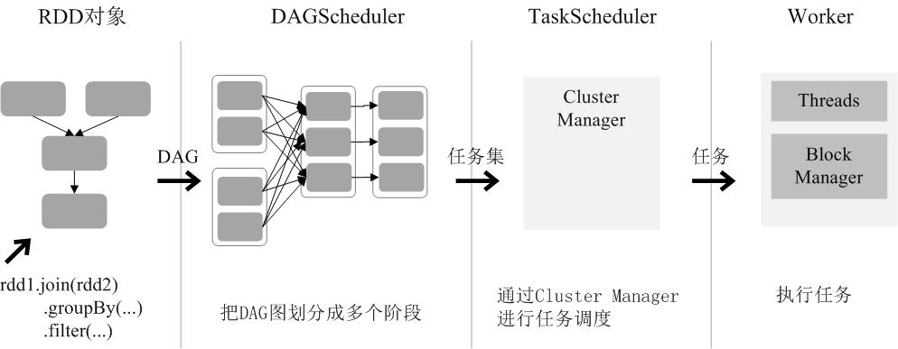

> Spark 的核心是建立在统一的抽象 RDD 之上，使得 Spark 的各个组件可以无缝进行集成，在同一个应用程序中完成大数据计算任务。

## 设计背景

在实际应用中，存在许多迭代式算法（比如机器学习、图算法等）和交互式数据挖掘工具，这些应用场景的共同之处是，不同计算阶段之间会重用中间结果，即 *一个阶段的输出结果会作为下一个阶段的输入*。但是，目前的 MapReduce 框架都是把中间结果写入到 HDFS 中，带来了大量的数据复制、磁盘IO 和序列化开销。虽然，类似 Pregel 等图计算框架也是将结果保存在内存当中，但是，这些框架只能支持一些特定的计算模式，并没有提供一种通用的数据抽象。RDD 就是为了满足这种需求而出现的，**它提供了一个抽象的数据架构**，用户不必担心底层数据的分布式特性，只需将具体的应用逻辑表达为一系列转换处理，不同 RDD 之间的转换操作形成依赖关系，可以实现管道化，从而避免了中间结果的存储，大大降低了数据复制、磁盘IO 和序列化开销。

## 概念

**RDD**，全称为 `Resilient Distributed Datasets`，是一个 *容错的*、*并行的* 数据结构，可以让用户显式地将数据存储到磁盘和内存中，并能控制数据的分区。

RDD 作为数据结构，本质上是 **一个只读的分区记录集合**。每个 RDD 可以分成多个分区，每个分区就是一个数据集片段，并且一个 RDD 的不同分区可以被保存到集群中不同的节点上，从而可以在集群中的不同节点上进行并行计算。

**RDD 提供了一种高度受限的共享内存模型**，即 RDD 是只读的记录分区的集合，不能直接修改，只能基于稳定的物理存储中的数据集来创建 RDD，或者通过在其他 RDD 上执行确定的转换操作（如map、join和groupBy）而创建得到新的 RDD。

RDD 提供了一组丰富的操作以支持常见的数据运算，分为 **行动（Action）** 和 **转换（Transformation）** 两种类型，前者用于执行计算并指定输出的形式，后者指定 RDD 之间的相互依赖关系。两类操作的主要区别是，转换操作（比如map、filter、groupBy、join等）接受 RDD 并返回 RDD，而行动操作（比如 count、collect 等）接受 RDD 但是返回非 RDD（即输出一个值或结果）。RDD 提供的转换接口都非常简单，都是类似 map、filter、groupBy、join 等粗粒度的数据转换操作，而不是针对某个数据项的细粒度修改。因此，RDD 比较适合对于数据集中元素执行相同操作的批处理式应用，而不适合用于需要异步、细粒度状态的应用，比如 Web 应用系统、增量式的网页爬虫等。正因为这样，这种粗粒度转换接口设计，会使人直觉上认为 RDD 的功能很受限、不够强大。但是，实际上 RDD 已经被实践证明可以很好地应用于许多并行计算应用中，可以具备很多现有计算框架（比如 MapReduce、SQL、Pregel 等）的表达能力，并且可以应用于这些框架处理不了的交互式数据挖掘应用。

> RDD 的上层表现过程如下所示：
>
> 1. RDD 读入外部数据源（或者内存中的集合）进行创建；
> 2. RDD 经过一系列的转化操作，每一次都会产生不同的 RDD，供给下一个转化操作使用；
> 3. 最后一个 RDD 经行动” 操作进行处理，并输出到外部数据源。
>

需要说明的是，*RDD 采用了 **惰性调用**，即在 RDD 的执行过程中，真正的计算发生在 RDD 的行动操作，对于行动操作之前的所有转化操作，Spark 只是记录下转化操作应用的一些基础数据集以及 RDD 生成的轨迹，即相互之间的依赖关系，而不会触发真正的计算*。

例如下图，从输入逻辑上生成 A 和 C 两个 RDD，经过一系列转化操作，逻辑上生成了 F（也是一个 RDD），之所以说是逻辑上，是因为这时候计算并没有发生，Spark 只是记录了 RDD 之间的生成和依赖关系。当 F 要进行输出时，也就是当 F 发生行动操作的时候，Spark 才会根据 RDD 的依赖关系生成 DAG，并从起点开始真正的计算。

上述这一系列处理称为一个 **血缘关系(lineage)**，即 DAG 拓扑排序的结果。

采用惰性调用，通过血缘关系连接起来的一系列 RDD 操作就可以实现管道化（pipeline），避免了多次转换操作之间数据同步的等待，而且不用担心有过多的中间数据，因为这些具有血缘关系的操作都管道化了，一个操作得到的结果不需要保存为中间数据，而是直接管道式地流入到下一个操作进行处理。同时，这种通过血缘关系把一系列操作进行管道化连接的设计方式，也使得管道中每次操作的计算变得相对简单，保证了每个操作在处理逻辑上的单一性；相反在 MapReduce 的设计中，为了尽可能地减少 MapReduce 过程，在单个 MapReduce 中会写入过多复杂的逻辑。

## 特性

总体而言，Spark 采用 RDD 以后能够实现高效计算的主要原因如下：

1. **[高效的容错性](RDD对容错性的支持.md)**：现有的分布式共享内存、键值存储、内存数据库等，为了实现容错，必须在集群节点之间进行数据复制或者记录日志，也就是在节点之间会发生大量的数据传输，这对于数据密集型应用而言会带来很大的开销。在 RDD 的设计中，数据只读，不可修改，如果需要修改数据，必须从父 RDD 转换到子 RDD，由此在不同 RDD 之间建立了血缘关系。所以，RDD 是一种天生具有容错机制的特殊集合，不需要通过数据冗余的方式（比如检查点）实现容错，而只需通过 RDD父子依赖（血缘）关系重新计算得到丢失的分区来实现容错，无需回滚整个系统，这样就避免了数据复制的高开销，而且重算过程可以在不同节点之间并行进行，实现了高效的容错。此外，RDD 提供的转换操作都是一些粗粒度的操作（比如 map、filter 和 join），RDD 依赖关系只需要记录这种粗粒度的转换操作，而不需要记录具体的数据和各种细粒度操作的日志（比如对哪个数据项进行了修改），这就大大降低了数据密集型应用中的容错开销；
2. **中间结果持久化到内存**：数据在内存中的多个 RDD 操作之间进行传递，不需要“落地”到磁盘上，避免了不必要的读写磁盘开销；
3. 存放的数据可以是Java对象，避免了不必要的对象序列化和反序列化开销。

## RDD 之间的依赖关系

RDD 中不同的操作会使得不同 RDD 中的分区会产生不同的依赖。RDD中的依赖关系分为 **窄依赖（Narrow Dependency）** 与 **宽依赖（Wide Dependency）**。

[RDD依赖关系](RDD依赖关系.md)

Spark 的这种依赖关系设计，使其具有了天生的容错性，大大加快了 Spark 的执行速度。因为，RDD 数据集通过*血缘关系*记住了它是如何从其它 RDD 中演变过来的，血缘关系记录的是粗颗粒度的转化操作行为，当这个 RDD 的部分分区数据丢失时，它可以通过血缘关系获取足够的信息来重新运算和恢复丢失的数据分区，由此带来了性能的提升。相对而言，在两种依赖关系中，窄依赖的失败恢复更为高效，它只需要根据父 RDD 分区重新计算丢失的分区即可（不需要重新计算所有分区），而且可以并行地在不同节点进行重新计算。而对于宽依赖而言，单个节点失效通常意味着重新计算过程会涉及多个父 RDD 分区，开销较大。此外，Spark  还提供了数据检查点和记录日志，用于持久化中间 RDD，从而使得在进行失败恢复时不需要追溯到最开始的阶段。在进行故障恢复时，Spark 会对数据检查点开销和重新计算 RDD 分区的开销进行比较，从而自动选择最优的恢复策略。

## 阶段的划分

Spark 通过分析各个 RDD 的依赖关系生成了  DAG，再通过分析各个 RDD 中的分区之间的依赖关系来决定如何划分阶段，具体划分方法是：*在 DAG 中进行反向解析，遇到宽依赖就断开，遇到窄依赖就把当前的 RDD 加入到当前的阶段中；将窄依赖尽量划分在同一个阶段中，可以实现流水线计算*。

例如如下图所示，假设从 HDFS 中读入数据生成 3 个不同的 RDD（即 A、C 和 E），通过一系列转化操作后再将计算结果保存回 HDFS。对 DAG 进行解析时，在依赖图中进行反向解析，由于从 `A->B` 以及 `B+F->G` 的转化，都属于宽依赖，因此，在宽依赖处断开后可以得到三个阶段，即阶段 1、阶段 2和阶段 3。可以看出，在阶段 2 中，从 map 到 union 都是窄依赖，这两步操作可以形成一个流水线操作，比如，分区 7 通过 map 操作生成的分区 9，可以不用等待分区 8 到分区 9 这个转换操作的计算结束，而是继续进行 union 操作，转化得到分区 13，这样流水线执行大大提高了计算的效率。

由上述论述可知，把一个 DAG 图划分成多个阶段以后，每个阶段都代表了一组关联的、相互之间没有 Shuffle 依赖关系的任务组成的任务集合。每个任务集合会被提交给任务调度器（TaskScheduler）进行处理，由任务调度器将任务分发给 Executor 运行。

## RDD 运行过程

RDD 在 Spark 架构中的运行过程如下所示：

1. 创建 RDD 对象；
2. SparkContext 负责计算 RDD 之间的依赖关系，构建 DAG；
3. DAGScheduler 负责把 DAG 图分解成多个阶段，每个阶段中包含了多个任务，每个任务会被任务调度器分发给各个工作节点（Worker Node）上的 Executor 去执行。

## 使用

根据 RDD 的上层表现过程，使用过程如下所示：

1. [RDD 读入外部数据源（或者内存中的集合）进行创建](RDD创建.md)；
2. [RDD 经过一系列的转化操作，每一次都会产生不同的 RDD，供给下一个转化操作使用](RDD操作.md)；
3. [最后一个 RDD 经行动操作进行处理，并输出到外部数据源](RDD操作.md)。

其他：

- [RDD的持久化](RDD持久化.md)