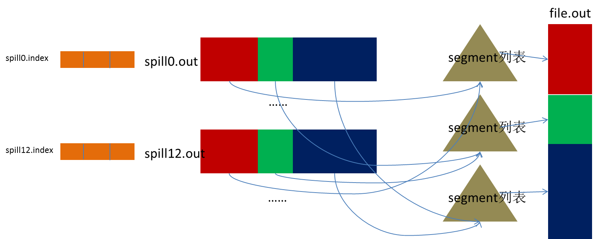

**Shuffle Writer**

Spark 丰富了任务类型，有些任务之间数据流转不需要通过 shuffle，但是有些任务之间还是需要通过 shuffle 来传递数据，比如 wide dependency 的 group by key。

Spark 中需要 shuffle 输出的 map 任务会为每个 reduce 创建对应的 bucket，map 产生的结果会根据设置的 partitioner 得到对应的 bucketId，然后填充到相应的 bucket 中去。每个 map 的输出结果可能包含所有的 reduce 所需要的数据，所以每个 map 会创建 R 个 bucket（R 是 reduce 的个数），M 个 map 总共会创建 M*R 个 bucket。

Map 创建的 bucket 其实对应磁盘上的一个文件，map 的结果写到每个 bucket 中其实就是写到那个磁盘文件中，这个文件也被称为 blockFile，是 DiskBlockManager 管理器通过文件名的 hash 值对应到本地目录的子目录中创建的。每个 map 要在节点上创建 R 个磁盘文件用于结果输出，map 的结果是直接输出到磁盘文件上的，100KB 的内存缓冲是用来创建 FastBufferedOutputStream 输出流。这种方式一个问题就是 shuffle 文件过多。

针对上述 shuffle 过程产生的文件过多问题，Spark 有另外一种改进的 shuffle 过程：consolidation shuffle，以期显著减少 shuffle 文件的数量。在 consolidation shuffle 中每个 bucket 并非对应一个文件，而是对应文件中的一个 segment 部分。Job 的 map 在某个节点上第一次执行，为每个 reduce 创建 bucket 对应的输出文件，把这些文件组织成 ShuffleFileGroup，当这次 map 执行完之后，这个 ShuffleFileGroup 可以释放为下次循环利用；当又有 map 在这个节点上执行时，不需要创建新的 bucket 文件，而是在上次的 ShuffleFileGroup 中取得已经创建的文件继续追加写一个 segment；当前次 map 还没执行完，ShuffleFileGroup 还没有释放，这时如果有新的 map 在这个节点上执行，无法循环利用这个 ShuffleFileGroup，而是只能创建新的 bucket 文件组成新的 ShuffleFileGroup 来写输出。

比如一个 job 有 3 个 map 和 2 个 reduce：(1) 如果此时集群有 3 个节点有空槽，每个节点空闲了一个 core，则 3 个 map 会调度到这 3 个节点上执行，每个 map 都会创建 2 个 shuffle 文件，总共创建 6 个 shuffle 文件；(2) 如果此时集群有 2 个节点有空槽，每个节点空闲了一个 core，则 2 个 map 先调度到这 2 个节点上执行，每个 map 都会创建 2 个 shuffle 文件，然后其中一个节点执行完 map 之后又调度执行另一个 map，则这个 map 不会创建新的 shuffle 文件，而是把结果输出追加到之前 map 创建的 shuffle 文件中；总共创建 4 个 shuffle 文件；(3) 如果此时集群有 2 个节点有空槽，一个节点有 2 个空 core 一个节点有 1 个空 core，则一个节点调度 2 个 map 一个节点调度 1 个 map，调度 2 个 map 的节点上，一个 map 创建了 shuffle 文件，后面的 map 还是会创建新的 shuffle 文件，因为上一个 map 还正在写，它创建的 ShuffleFileGroup 还没有释放；总共创建 6 个 shuffle 文件。

### **Shuffle Fetcher**

Reduce 去拖 map 的输出数据，Spark 提供了两套不同的拉取数据框架：通过 socket 连接去取数据；使用 netty 框架去取数据。

每个节点的 Executor 会创建一个 BlockManager，其中会创建一个 BlockManagerWorker 用于响应请求。当 reduce 的 GET_BLOCK 的请求过来时，读取本地文件将这个 blockId 的数据返回给 reduce。如果使用的是 Netty 框架，BlockManager 会创建 ShuffleSender 用于发送 shuffle 数据。

并不是所有的数据都是通过网络读取，对于在本节点的 map 数据，reduce 直接去磁盘上读取而不再通过网络框架。

Reduce 拖过来数据之后以什么方式存储呢？Spark map 输出的数据没有经过排序，spark shuffle 过来的数据也不会进行排序，spark 认为 shuffle 过程中的排序不是必须的，并不是所有类型的 reduce 需要的数据都需要排序，强制地进行排序只会增加 shuffle 的负担。Reduce 拖过来的数据会放在一个 HashMap 中，HashMap 中存储的也是 <key, value> 对，key 是 map 输出的 key，map 输出对应这个 key 的所有 value 组成 HashMap 的 value。Spark 将 shuffle 取过来的每一个 <key, value> 对插入或者更新到 HashMap 中，来一个处理一个。HashMap 全部放在内存中。

Shuffle 取过来的数据全部存放在内存中，对于数据量比较小或者已经在 map 端做过合并处理的 shuffle 数据，占用内存空间不会太大，但是对于比如 group by key 这样的操作，reduce 需要得到 key 对应的所有 value，并将这些 value 组一个数组放在内存中，这样当数据量较大时，就需要较多内存。

当内存不够时，要不就失败，要不就用老办法把内存中的数据移到磁盘上放着。Spark 意识到在处理数据规模远远大于内存空间时所带来的不足，引入了一个具有外部排序的方案。Shuffle 过来的数据先放在内存中，当内存中存储的 <key, value> 对超过 1000 并且内存使用超过 70% 时，判断节点上可用内存如果还足够，则把内存缓冲区大小翻倍，如果可用内存不再够了，则把内存中的 <key, value> 对排序然后写到磁盘文件中。最后把内存缓冲区中的数据排序之后和那些磁盘文件组成一个最小堆，每次从最小堆中读取最小的数据，这个和 MapReduce 中的 merge 过程类似。

### **MapReduce****和 Spark 的 Shuffle 过程对比**

|                         | MapReduce                                           | Spark                                                        |
| ----------------------- | --------------------------------------------------- | ------------------------------------------------------------ |
| collect                 | 在内存中构造了一块数据结构用于 map 输出的缓冲       | 没有在内存中构造一块数据结构用于 map 输出的缓冲，而是直接把输出写到磁盘文件 |
| sort                    | map 输出的数据有排序                                | map 输出的数据没有排序                                       |
| merge                   | 对磁盘上的多个 spill 文件最后进行合并成一个输出文件 | 在 map 端没有 merge 过程，在输出时直接是对应一个 reduce 的数据写到一个文件中，这些文件同时存在并发写，最后不需要合并成一个 |
| copy 框架               | jetty                                               | netty 或者直接 socket 流                                     |
| 对于本节点上的文件      | 仍然是通过网络框架拖取数据                          | 不通过网络框架，对于在本节点上的 map 输出文件，采用本地读取的方式 |
| copy 过来的数据存放位置 | 先放在内存，内存放不下时写到磁盘                    | 一种方式全部放在内存；另一种方式先放在内存                   |
| merge sort              | 最后会对磁盘文件和内存中的数据进行合并排序          | 对于采用另一种方式时也会有合并排序的过程                     |

### **Shuffle****后续优化方向**

通过上面的介绍，我们了解到，shuffle 过程的主要存储介质是磁盘，尽量的减少 io 是 shuffle 的主要优化方向。我们脑海中都有那个经典的存储金字塔体系，shuffle 过程为什么把结果都放在磁盘上，那是因为现在内存再大也大不过磁盘，内存就那么大，还这么多张嘴吃，当然是分配给最需要的了。如果具有“土豪”内存节点，减少 shuffle io 的最有效方式无疑是尽量把数据放在内存中。下面列举一些现在看可以优化的方面，期待经过我们不断的努力，TDW 计算引擎运行地更好。

### **MapReduce Shuffle****后续优化方向**

- 压缩：对数据进行压缩，减少写读数据量；
- 减少不必要的排序：并不是所有类型的 reduce 需要的数据都是需要排序的，排序这个 nb 的过程如果不需要最好还是不要的好；
- 内存化：shuffle 的数据不放在磁盘而是尽量放在内存中，除非逼不得已往磁盘上放；当然了如果有性能和内存相当的第三方存储系统，那放在第三方存储系统上也是很好的；这个是个大招；
- 网络框架：netty 的性能据说要占优了；
- 本节点上的数据不走网络框架：对于本节点上的 map 输出，reduce 直接去读吧，不需要绕道网络框架。

### **Spark Shuffle****后续优化方向**

Spark 作为 MapReduce 的进阶架构，对于 shuffle 过程已经是优化了的，特别是对于那些具有争议的步骤已经做了优化，但是 Spark 的 shuffle 对于我们来说在一些方面还是需要优化的。

- 压缩：对数据进行压缩，减少写读数据量；
- 内存化：Spark 历史版本中是有这样设计的：map 写数据先把数据全部写到内存中，写完之后再把数据刷到磁盘上；考虑内存是紧缺资源，后来修改成把数据直接写到磁盘了；对于具有较大内存的集群来讲，还是尽量地往内存上写吧，内存放不下了再放磁盘。