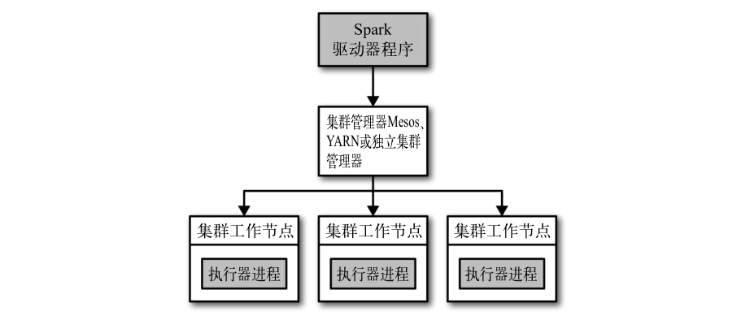

# Spark 运行时架构

在分布式环境下，Spark 集群采用的是 **主/从结构**。在一个 Spark 集群中，有一个节点负责中央协调，调度各个分布式工作节点。这个中央协调节点被称为 **驱动器（Driver）** 节点，与之对应的工作节点被称为 **执行器（Executor）**。驱动器节点可以和大量的执行器节点间进行通信，它们也都作为独立的 Java 进程运行。驱动器节点和所有的执行器节点一起被称为一个 **Spark 应用（application）**。

Spark 应用通过一个叫做 **集群管理器（Cluster Manager）** 的外部服务在集群中的机器上启动。Spark 支持的集群管理器如下：

- 独立集群管理器，这是 Spark 自带的集群管理器
- Mesos
- YARN

## 驱动器节点

Spark 驱动器是执行用户的程序中的 `main()` 方法的进程。它执行用户编写的用来创建 SparkContext、创建 RDD，以及进行 RDD 转换操作和行动操作的代码。

驱动器程序在 Spark 应用中有下述两个职责：

- 把用户任务转为任务

  Spark 驱动器程序负责把用户程序转为多个物理执行的单元，这些单元也被称为 **任务（task）**。从上层来看，所有的 Spark 程序都遵循同样的结构：程序从输入数据创建一系列 RDD，再使用转换操作派生出新的 RDD，最后使用行动操作收集或存储结果 RDD 中的数据。Spark 程序其实是隐式地创建出了一个由操作组成的逻辑上的 **有向无环图（Directed Acyclic Graph，简称 DAG）**。当驱动器程序运行时，它会把这个逻辑图转为物理执行计划。

  Spark 会对逻辑执行计划作一些优化，比如将连续的映射转为流水线化执行，将多个操作合并到一个步骤中等。这样 Spark 就把逻辑计划转为一系列 **步骤（stage）**。而每个步骤又由多个 **任务（task）** 组成。这些任务会被打包并送到集群中。任务是 Spark 中最小的工作单元，用户程序通常要启动成百上千的独立任务。

- 为执行器节点调度任务

  有了物理执行计划之后，Spark 驱动器程序必须在各执行器进程间协调任务的调度。执行器进程启动后，会向驱动器进程注册自己。因此，驱动器进程始终对应用中所有的执行器节点有完整的记录。每个执行器节点代表一个能够处理任务和存储 RDD 数据的进程。

Spark 驱动器程序会根据当前的执行器节点集合，尝试把所有任务基于数据所在位置分配给合适的执行器进程。当任务执行时，执行器进程会把缓存数据存储起来，而驱动器进程同样会跟踪这些缓存数据的位置，并且利用这些位置信息来调度以后的任务，以尽量减少数据的网络传输。

驱动器程序会将一些 Spark 应用的运行时的信息通过网页界面呈现出来，默认在端口 4040 上。

## 执行器节点

Spark 执行器节点是一种工作进程，负责在 Spark 作业中运行任务，任务之间相互独立。Spark 应用启动时，执行器节点就被同时启动，并且始终伴随着整个 Spark 应用的生命周期而存在。如果执行器节点发生了异常或崩溃，Spark 应用也可以继续执行。执行器进程有两大作用：第一，它们负责运行组成了 Spark 应用的任务，并将结果返回给驱动器进程；第二，它们通过自身的块管理器（Block Manager）为用户程序中要求缓存的 RDD 提供内存式存储。RDD 是直接缓存在执行器进程内的，因此任务可以在运行时充分利用缓存数据加速运算。