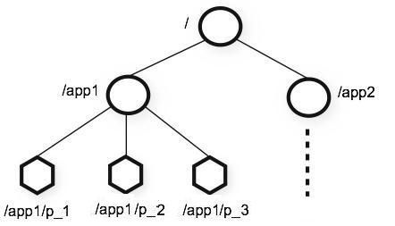
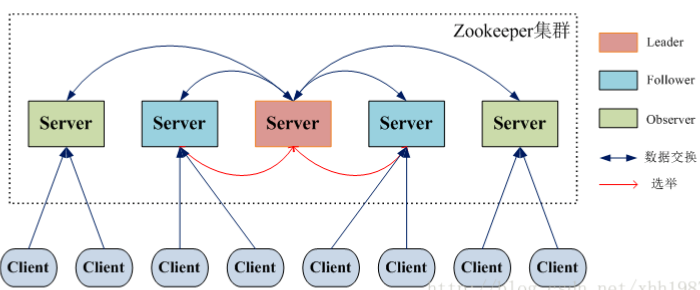

## 简介

下面这段内容摘自《从Paxos到Zookeeper 》第四章第一节的某段内容，推荐大家阅读以下：

> Zookeeper 最早起源于雅虎研究院的一个研究小组。在当时，研究人员发现，在雅虎内部很多大型系统基本都需要依赖一个类似的系统来进行分布式协调，但是这些系统往往都存在分布式单点问题。所以，**雅虎的开发人员就试图开发一个通用的无单点问题的分布式协调框架，以便让开发人员将精力集中在处理业务逻辑上。**
>
> 关于“ZooKeeper”这个项目的名字，其实也有一段趣闻。在立项初期，考虑到之前内部很多项目都是使用动物的名字来命名的（例如著名的Pig项目),雅虎的工程师希望给这个项目也取一个动物的名字。时任研究院的首席科学家RaghuRamakrishnan开玩笑地说：“在这样下去，我们这儿就变成动物园了！”此话一出，大家纷纷表示就叫动物园管理员吧一一一因为各个以动物命名的分布式组件放在一起，雅虎的整个分布式系统看上去就像一个大型的动物园了，而Zookeeper正好要用来进行分布式环境的协调一一于是，Zookeeper的名字也就由此诞生了。

Zookeeper 是一个开源的**分布式协调服务**。后来，Apache Zookeeper 成为 Hadoop、HBase 和其他分布式框架使用的有组织服务的标准。例如，Apache HBase 使用 Zookeeper 跟踪分布式数据的状态。

**Zookeeper 的设计目标是将那些复杂且容易出错的分布式一致性服务封装起来，构成一个高效可靠的原语集，并以一系列简单易用的接口提供给用户使用**。

> 原语：操作系统或计算机网络用语范畴。是由若干条指令组成的，用于完成一定功能的一个过程。具有不可分割性，即原语的执行必须是连续的，在执行过程中不允许被中断。

**Zookeeper 是一个典型的分布式数据一致性解决方案，分布式应用程序可以基于 Zookeeper 实现诸如数据发布/订阅、负载均衡、命名服务、分布式协调/通知、集群管理、Master 选举、分布式锁和分布式队列等功能**。

**Zookeeper 一个最常用的使用场景就是用于担任服务生产者和服务消费者的注册中心**。服务生产者将自己提供的服务注册到 Zookeeper 中心，服务的消费者在进行服务调用的时候先到 Zookeeper 中查找服务，获取到服务生产者的详细信息之后，再去调用服务生产者的内容与数据。

## 安装部署

[Zookeeper安装和部署.md](Zookeeper安装和部署.md) 

**bin目录下常用的脚本解释**

| 脚本命令  | 作用                                                  |
| --------- | ----------------------------------------------------- |
| zkCleanup | 清理Zookeeper历史数据，包括事务日志文件和快照数据文件 |
| zkCli     | Zookeeper的一个简易客户端                             |
| zkEnv     | 设置Zookeeper的环境变量                               |
| zkServer  | Zookeeper服务器的启动、停止、和重启脚本               |

## 概念

### Znode

Zookeeper 将所有数据存储在内存中，数据模型是一棵树（ZnodeTree），由斜杠（/）进行分割的路径，就是一个 ZNode，例如`/foo/path1`。每个节点上都会保存自己的数据内容，同时还会保存一系列属性信息。

**在 Zookeeper 中，Znode 可以分为持久节点和临时节点两类。持久节点是指一旦这个 Znode 被创建了，除非主动进行 Znode 的移除操作，否则这个 Znode 将一直保存在 Zookeeper 上。而临时节点的生命周期和客户端会话绑定，一旦客户端会话失效，那么这个客户端创建的所有临时节点都会被移除**。另外，Zookeeper 还允许用户为每个节点添加一个特殊的属性：**`SEQUENTIAL`**，一旦节点被标记上这个属性，那么在这个节点被创建的时候，Zookeeper 会自动在其节点名后面追加一个整型数字，这个整型数字是一个由父节点维护的自增数字。

### 版本

在 Zookeeper 中，每个 Znode 上都会存储数据，对于每个 Znode，Zookeeper 都会为其维护一个叫做 **Stat** 的数据结构，Stat 中记录了这个 Znode 的三个数据版本，分别是 version（当前 Znode 的版本）、cversion（当前 Znode 子节点的版本）和 aclVerion（当前 Znode 的 ACL 版本）

### Watcher

**Watcher（事件监听器），是 Zookeeper 中一个很重要的特性。Zookeeper 允许用户在指定节点上注册一些 Watcher，并且在一些特定事件触发的时候，Zookeeper 服务端会将事件通知到感兴趣的客户端上去，该机制是 Zookeeper 实现分布式协调服务的重要特性**

### ACL

Zookeeper 采用 ACL（AccessControlLists）策略来进行权限控制，类似于 UNIX 文件系统的权限控制。

Zookeeper 定义了 5 中权限：

- CREATE：创建子节点的权限
- READ：获取节点数据和子节点列表的权限
- WRITE：更新节点数据的权限
- DELETE：删除子节点的权限
- ADMIN：设置节点 ACL 的权限

注意：CREATE 和 DELETE 这两种权限都是针对子节点的权限控制。

## Zookeeper 基本原理

### Zookeeper 设计目标

Zookeeper 允许分布式进程通过共享的层次结构命名空间进行相互协调，这与标准文件系统类似。名称空间由 Zookeeper 中的数据寄存器组成 - 称为 Znode，这些节点类似于文件和目录。与为存储设计的典型文件系统不同，Zookeeper 数据保存在内存中，这意味着 Zookeeper 可以实现高吞吐量和低延迟。

Zookeeper 层次结构命名空间示意图如下：

通过这种树形结构的数据模型，很容易的查找到具体的某一个服务。

### Zookeeper 特点

- **最终一致性**：无论客户端连到哪一个 Zookeeper 服务器上，其看到的服务端数据模型都是一致的
- **可靠性**：一旦一次更改请求被应用，更改的结果将会被持久化，直到被下一次更改覆盖
- **实时性**：ZooKeeper 不能保证两个客户端同时得到刚更新的数据，如果需要最新数据，应该在读数据之前调用 `sync()` 接口
- **顺序一致性**：从同一客户端发起的事务请求，最终将会严格地按照顺序被应用到 Zookeeper 中去
- **原子性**：所有事务请求的处理结果在整个集群中所有机器上的应用情况是一致的，也就是说，要么整个集群中所有机器都成功应用了某一个事务，要么都没有应用

### Zookeeper 系统架构

[系统架构](./Zookeeper系统架构.md)

### Zookeeper角色

最典型集群模式：Master/Slave 模式（主备模式）。在这种模式中，通常 Master 服务器作为主服务器提供写服务，其他的 Slave 服务器通过异步复制的方式获取 Master 服务器最新的数据提供读服务。

但是，在 Zookeeper 中没有选择传统的 Master/Slave 概念，而是引入了 Leader、Follower 和 Observer 三个角色。如下图所示

Zookeeper 集群中的所有机器通过一个 Leader 选举过程来选定一台称为 “Leader” 的机器，Leader 既可以为客户端提供写服务又能提供读服务。除了 Leader 外，Follower 和 Observer 都只能提供读服务。Follower 和 Observer 唯一的区别在于 Observer 机器不参与 Leader 的选举过程，也不参与写操作的 “过半写成功” 策略，因此 Observer 机器可以在不影响写性能的情况下提升集群的读性能。

## 命令行使用

 [Zookeeper之命令行使用.md](Zookeeper之命令行使用.md) 

## Zookeeper 应用场景总结

 [Zookeeper应用场景总结.md](Zookeeper应用场景总结.md) 