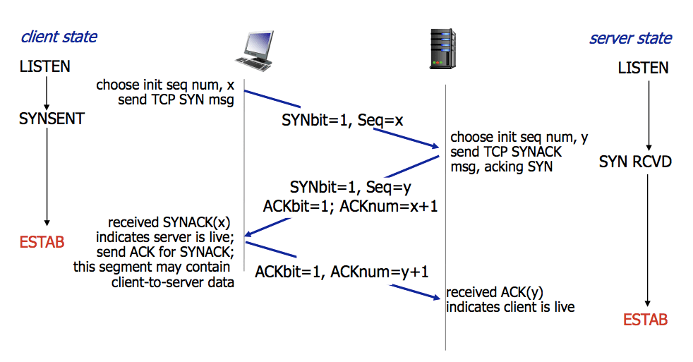
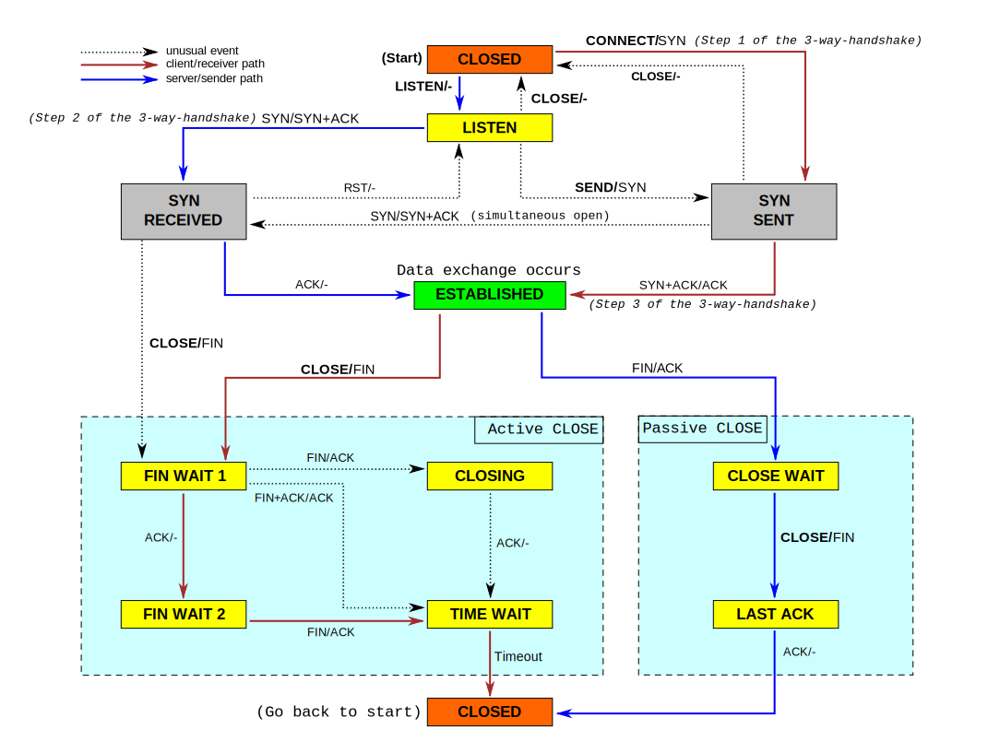

传输控制协议（英语：Transmission Control Protocol，缩写：TCP）是一种面向连接的、可靠的、基于字节流的传输层通信协议，由 IETF 的 RFC 793 定义。在简化的计算机网络 OSI 模型中，它完成第四层传输层所指定的功能。

TCP 协议是目前整个互联网的基础，它解决了一系列的网络问题。带来的结果，就是协议本身非常复杂。

## 三次握手



1. 第一次握手(`SYN=1`, `seq=x`):

   客户端发送一个 TCP 的 `SYN` 标志位置 `1` 的包，指明客户端打算连接的服务器的端口，以及初始序号 `x`，保存在包头的序列号(`Sequence Number`)字段里。

   发送完毕后，客户端进入 `SYN_SEND` 状态。

2. 第二次握手(`SYN=1`、`seq=y`；`ACK=1`、`ACKnum=x+1`):

   服务器发回确认包(`ACK`)应答。即 `SYN` 标志位和 `ACK` 标志位均为 `1`。服务器端选择自己 `ISN` 序列号，放到包头的序列号(`Sequence Number`)字段里，同时将确认序号(`Acknowledgement Number`)设置为客户的 `ISN` 加 `1`，即 `x+1`。

   发送完毕后，服务器端进入 `SYN_RCVD` 状态。

3. 第三次握手(`ACK=1`，`ACKnum=y+1`)

   客户端再次发送确认包(`ACK`)，SYN 标志位为 `0`，`ACK` 标志位为 `1`，并且把服务器发来 `ISN` 的序号字段+1，放在确定字段中发送给对方，即数据段放写 `y+1`。

   发送完毕后，客户端进入 `ESTABLISHED` 状态，当服务器端接收到这个包时，也进入 `ESTABLISHED` 状态，TCP 握手结束。

## 四次挥手


1. 第一次挥手(`FIN=1`，`seq=x`)

   假设客户端想要关闭连接，客户端发送一个 `FIN` 标志位置为 `1` 的包，表示自己已经没有数据可以发送了，但是仍然可以接受数据。

   发送完毕后，客户端进入 `FIN_WAIT_1` 状态。

2. 第二次挥手(`ACK=1`，`ACKnum=x+1`)

   服务器端确认客户端的 `FIN` 包，发送一个确认包，表明自己接受到了客户端关闭连接的请求，但还没有准备好关闭连接。

   发送完毕后，服务器端进入 `CLOSE_WAIT` 状态，客户端接收到这个确认包之后，进入 `FIN_WAIT_2` 状态，等待服务器端关闭连接。

3. 第三次挥手(`FIN=1`，`seq=y`)

   服务器端准备好关闭连接时，向客户端发送结束连接请求，`FIN` 置为 `1`。

   发送完毕后，服务器端进入 `LAST_ACK` 状态，等待来自客户端的最后一个 `ACK`。

4. 第四次挥手(`ACK=1`，`ACKnum=y+1`)

   客户端接收到来自服务器端的关闭请求，发送一个确认包，并进入 `TIME_WAIT` 状态，等待可能出现的要求重传的 `ACK` 包。

   服务器端接收到这个确认包之后，关闭连接，进入 `CLOSED` 状态。

   客户端等待了某个固定时间（两个最大段生命周期，2MSL，2 Maximum Segment Lifetime）之后，没有收到服务器端的 `ACK`，认为服务器端已经正常关闭连接，于是自己也关闭连接，进入 `CLOSED` 状态。

## TCP状态转换

TCP 的完整状态转换图如下：



- **CLOSED**: 这个没什么好说的了，表示初始状态。

- **LISTEN（服务器）**: 这个也是非常容易理解的一个状态，表示服务器端的某个 SOCKET 处于监听状态，可以接受连接了。

- **SYN_RCVD（服务器）**: 这个状态表示接受到了 `SYN` 报文，在正常情况下，这个状态是服务器端的 SOCKET 在建立 TCP 连接时的三次握手会话过程中的一个中间状态，很短暂，基本上用 `netstat` 你是很难看到这种状态的，除非你特意写了一个客户端测试程序，故意将三次 TCP 握手过程中最后一个 `ACK` 报文不予发送。因此这种状态时，当收到客户端的 `ACK` 报文后，它会进入到 `ESTABLISHED` 状态。

- **SYN_SENT**: 这个状态与 `SYN_RCVD` 遥相呼应，当客户端 SOCKET 执行 CONNECT 连接时，它首先发送 `SYN` 报文，因此也随即它会进入到了 `SYN_SENT` 状态，并等待服务端的发送三次握手中的第 2 个报文。`SYN_SENT` 状态表示客户端已发送 `SYN` 报文。

- **ESTABLISHED**：这个容易理解了，表示连接已经建立了。

- **FIN_WAIT_1**: 这个状态要好好解释一下，其实 `FIN_WAIT_1` 和 `FIN_WAIT_2` 状态的真正含义都是表示等待对方的 `FIN` 报文。而这两种状态的区别是：`FIN_WAIT_1` 状态实际上是当 SOCKET 在 `ESTABLISHED` 状态时，它想主动关闭连接，向对方发送了 `FIN` 报文，此时该 SOCKET 即进入到 `FIN_WAIT_1` 状态。而当对方回应 `ACK` 报文后，则进入到 `FIN_WAIT_2` 状态，当然在实际的正常情况下，无论对方何种情况下，都应该马上回应 `ACK` 报文，所以 `FIN_WAIT_1` 状态一般是比较难见到的，而 `FIN_WAIT_2` 状态还有时常常可以用 `netstat` 看到。

- **FIN_WAIT_2**：上面已经详细解释了这种状态，实际上 `FIN_WAIT_2` 状态下的 SOCKET，表示半连接，也即有一方要求 close 连接，但另外还告诉对方，我暂时还有点数据需要传送给你，稍后再关闭连接。

- **TIME_WAIT**: 表示收到了对方的 `FIN` 报文，并发送出了 `ACK` 报文，就等 2MSL 后即可回到 `CLOSED` 可用状态了。如果 `FIN_WAIT_1` 状态下，收到了对方同时带 `FIN` 标志和 `ACK` 标志的报文时，可以直接进入到 `TIME_WAIT` 状态，而无须经过 `FIN_WAIT_2` 状态。

  MSL(最大分段生存期)指明 TCP 报文在 Internet 上最长生存时间,每个具体的 TCP 实现都必须选择一个确定的 MSL 值。RFC 1122 建议是2分钟,但 BSD 传统实现采用了 30 秒。`TIME_WAIT` 状态最大保持时间是 2 * MSL，也就是 1-4 分钟.

  结论：在 `TIME_WAIT` 下等待 2MSL，只是为了尽最大努力保证四次握手正常关闭。确保老的报文段在网络中消失，不会影响新建立的连接.

- **CLOSING**: 这种状态比较特殊，实际情况中应该是很少见，属于一种比较罕见的例外状态。正常情况下，当你发送 `FIN` 报文后，按理来说是应该先收到（或同时收到）对方的 `ACK` 报文，再收到对方的 `FIN` 报文。但是 `CLOSING` 状态表示你发送 `FIN` 报文后，并没有收到对方的 `ACK` 报文，反而却也收到了对方的 `FIN` 报文。什么情况下会出现此种情况呢？其实细想一下，也不难得出结论：那就是**如果双方几乎在同时 close 一个 SOCKET 的话，那么就出现了双方同时发送 `FIN` 报文的情况，也即会出现 `CLOSING` 状态，表示双方都正在关闭SOCKET连接。**

- **CLOSE_WAIT**: 这种状态的含义其实是表示在等待关闭。怎么理解呢？当对方 close 一个 SOCKET 后发送 `FIN` 报文给自己，你系统毫无疑问地会回应一个 `ACK` 报文给对方，此时则进入到 `CLOSE_WAIT` 状态。接下来呢，实际上你真正需要考虑的事情是察看你是否还有数据发送给对方，如果没有的话，那么你也就可以 close 这个 `SOCKET`，发送 `FIN` 报文给对方，也即关闭连接。所以你在 `CLOSE_WAIT` 状态下，需要完成的事情是等待你去关闭连接。

- **LAST_ACK**: 这个状态还是比较容易好理解的，它是被动关闭一方在发送 `FIN` 报文后，最后等待对方的 `ACK` 报文。当收到 `ACK` 报文后，也即可以进入到 `CLOSED` 可用状态了。

补充说明一下：

1. 默认情况下(不改变socket选项)，当你调用 `close`( or `closesocket`，以下说 `close` 不再重复)时，如果发送缓冲中还有数据，TCP会继续把数据发送完。
2. 发送了 `FIN` 只是表示这端不能继续发送数据(应用层不能再调用 `send` 发送)，但是还可以接收数据。
3. 应用层如何知道对端关闭？通常，在最简单的阻塞模型中，当你调用 `recv` 时，如果返回 `0`，则表示对端关闭。在这个时候通常的做法就是也调用 `close`，那么 TCP 层就发送 `FIN`，继续完成四次握手。如果你不调用 `close`，那么对端就会处于 `FIN_WAIT_2` 状态，而本端则会处于 `CLOSE_WAIT` 状态。
4. 在很多时候，TCP 连接的断开都会由 TCP 层自动进行，例如你 CTRL+C 终止你的程序，TCP 连接依然会正常关闭。

## 常见问题答疑

### 为什么建立连接是三次握手，而关闭连接却是四次挥手呢？

这是因为服务端在 `LISTEN` 状态下，收到建立连接请求的 `SYN` 报文后，把 `ACK` 和 `SYN` 放在一个报文里发送给客户端。

而关闭连接时，当收到对方的 `FIN` 报文时，仅仅表示对方不再发送数据了但是还能接收数据，而 TCP 是一个全双工的协议，己方是否现在关闭发送数据通道，需要上层应用来决定，因此，己方 `ACK` 和 `FIN` 一般都会分开发送。

### 为什么 `TIME_WAIT` 状态需要经过 2MSL(最大报文段生存时间)才能返回到 `CLOSED` 状态？

什么是 2MSL？MSL 即 Maximum Segment Lifetime，也就是报文最大生存时间，引用《TCP/IP详解》中的话：“它(MSL)是任何报文段被丢弃前在网络内的最长时间。”那么，2MSL 也就是这个时间的 2 倍，当 TCP 连接完成四个报文段的交换时，主动关闭的一方将继续等待一定时间(2-4分钟)，即使两端的应用程序结束。例如在客户端关闭后，使用 `netstat` 查看的结果：`netstat -na`。

1. 虽然双方都同意关闭连接了，而且握手的4个报文也都协调和发送完毕，按理可以直接回到CLOSED状态（就好比从 `SYN_SEND` 状态到 `ESTABLISH` 状态那样）；但是因为我们必须要假想网络是不可靠的，你无法保证你最后发送的 `ACK` 报文会一定被对方收到，因此对方处于 `LAST_ACK` 状态下的 SOCKET 可能会因为超时未收到 `ACK` 报文，而重发 `FIN` 报文，所以这个 `TIME_WAIT` 状态的作用就是用来**重发可能丢失的ACK报文，保证发送的最后一个 `ACK` 报文段能够到达对方。**
2. 报文可能会被混淆，意思是说，其他时候的连接可能会被当作本次的连接。防止“已失效的连接请求报文段”出现在本连接中。在发送完最后一个 `ACK` 报文段后，再经过实践 2MSL，就可以使本连接持续的时间内所产生的所有报文段，都从网络中消失。这样就可以使下一个新的连接中不会出现这种就得连接请求报文段。

### 为什么会有大量 `CLOSE_WAIT` 状态的链接？

使用如下命令查看各个状态的链接数量：

```bash
$ netstat -na | awk '/^tcp/ {++S[$NF]} END {for(a in S) print a, S[a]}'
```

使用如下命令，结合状态就能看出链接的状态，可以看出哪一方主动关闭链接，以及另外一方的地址：

```bash
$ netstat -anop tcp
```

大量 `TIME_WAIT` 状态的链接是由于彼方主动关闭链接，己方再次发送 `FIN` 报文没有正常 `ACK` 造成的。大部分情况下是 TCP 连接超时导致的。

一台服务器上 `CLOSE_WAIT` 堆积，导致端口无法释放，进而不能对外提供服务。

在有负载均衡的服务中，一台服务器出现 `CLOSE_WAIT` 堆积问题，则由于洪水蔓延，当负载均衡发现下面的一个节点不可用会把请求 routing 到其他可用节点上，导致其他节点压力增大。也犹豫相同原因，加速了其他节点出现 `CLOSE_WAIT`。

### 常见排查工具

```bash
# 列出所有 tcp 的连接
$ netstat -ant

# 只列出处于监听状态的连接
$ netstat -tnl

# 查看监听中的进程名和用户名
$ netstat -tnl

# 查看网络接口
$ netstat -ie
$ ip a
$ ifconfig

# 统计 TCP 每个连接状态信息
$ netstat -n | awk /^tcp/ {++S[$NF]} END {for(a in S) print a, S[a]}

# 对tcp端口为9000的进行抓包
$ tcpdump -iany tcp port 900

# 查找某个文件相关的进程
$ lsof /bin/bash

# 列出某个用户打开的文件信息
$ lsof -u username

# 列出某个程序进程所打开的文件信息
$ lsof -c mysql

# 通过某个进程号显示该进程打开的文件
$ lsof -p 11968

# 列出所有 tcp 网络连接信息
$ lsof -i tcp

# 列出某个端口被哪个进程占用
$ lsof -i :3306
```