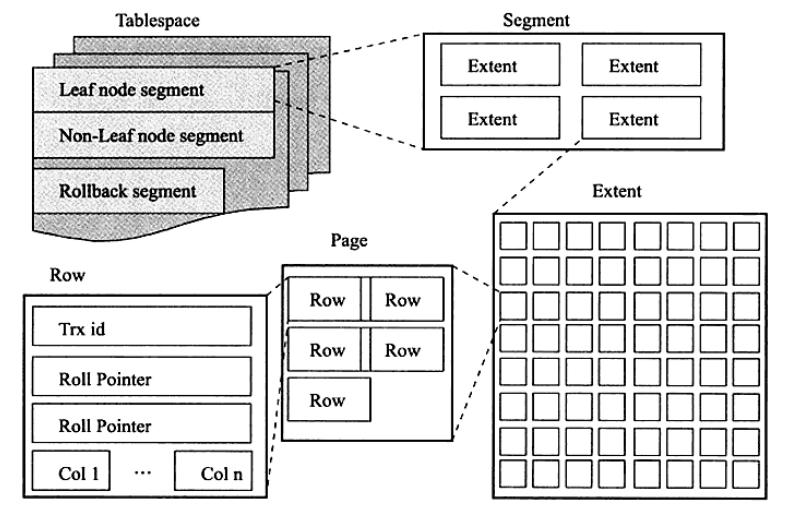

# InnoDB 逻辑存储结构

从 InnoDB 存储引擎的逻辑存储结构来看，所有数据都被逻辑地存放在一个空间中，称之为表空间（tablespace）。表空间又由段（segment）、区（extent）、页（page）组成。页在一些文档中有时也称为块（block），InnoDB 存储引擎的逻辑存储结构大致如下所示：

## 表空间

表空间可以看做是 InnoDB 存储引擎的逻辑结构的最高层，所有的数据都存放在表空间中。

在默认情况下 InnoDB 存储引擎有一个共享表空间（ibdata1），即所有的数据都存放在这个表空间内。如果用户启用了参数 `innodb_file_per_table` 参数，则每张内的数据可以单独放到一个表空间内。

如果启用了 `innodb_file_per_table` 的参数，需要注意的是每张表的表空间内存放的只是数据、索引和插入缓冲 Bitmap 页，其他类的数据，如回滚（undo）信息，插入缓冲索引页、系统事务信息等，二次写缓冲（Double write buffer）等还是存放在原来的共享表空间内。

## 段

表空间是由各个段组成的，常见的段有数据段、索引段、回滚段等。

在 InnoDB 存储引擎中，对段的管理都是由引擎自身所完成，用户不能也没有必要对其进行控制。

## 区

区是由连续页组成的空间，在任何情况下每个区的大小都为 1MB。为了保证区中页的连续性，InnoDB 存储引擎一次从磁盘申请 4~5 个区。在默认情况下，InnoDB 存储引擎页的大小为 16KB，即一个区中一共有 64 个连续的页。

## 页

同大多数数据库一样，InnoDB 有页（Page）的概念（也可以称为块），页是 InnoDB 磁盘管理的最小单位。在 InnoDB 存储引擎中，默认每个页的大小为 16KB。而从 InnoDB 1.2.x 版本开始，可以通过参数 `innodb_page_size` 将页的大小设置为 4KB、8KB、16KB，若设置完成，则所有表中页的大小都为 `innodb_page_size`，不可以对其再次进行修改。

在 InnoDB 存储引擎中，常见的页类型有：

- 数据页（B-tree Node）
- undo 页（undo Log Page）
- 系统页（System Page）
- 事务数据页（Transaction system Page）
- 插入缓冲位图页（Insert Buffer Bitmap）
- 插入缓冲空闲列表页（Insert Buffer Free List）
- 未压缩的二进制大对象页（Uncompressed BLOB Page）
- 压缩的二进制大对象页（compressed BLOB Page）

## 行

InnoDB 存储引擎是面向列的（row-oriented），也就是说数据是按照行进行存储的。