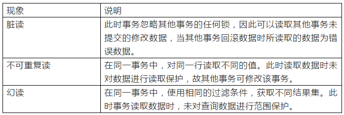

> 事务是一组原子性的 SQL 查询，或者说一个独立的工作单元。事务内的语句要么全部执行成功，要么全部执行失败。

实现事务需要满足 ACID 特征。ACID 表示原子性（automicity）、一致性（consistency）、隔离性（isolation）、持久性（durability）。

- 原子性（automicity）
  
  > 一个事务必须被视为一个不可分割的最小工作单元，整个事务中的所有操作要么全部提交成功，要么全部失败回滚，对于一个事务来说，不可能只执行其中的一部分操作，这就是事务的原子性。
- 一致性（consistency）
  
  > 数据库总是从一个一致性的状态转换到另外一个一致性的状态。
- 隔离性（isolation）
  
  > 通常来说，一个事务所做的修改在最终提交以前，对其他事务是不可见的。
- 持久性（durability）
  
  > 一旦事务提交，则其所做的修改就会永久保存到数据库中。

## 隔离级别

在 SQL 标准中定义了四种隔离级别，每一种级别都规定了一个事务中所做的修改，哪些在事务内和事务间是可见的，哪些是不可见的。较低级别的隔离通常可以执行更高的并发，系统的开销也更低。

### READ UNCOMMITED（未提交读）

在 READ UNCOMMITED 级别，事务中的修改，即使没有提交，对其他事务也是可见的。**事务可以读取未提交的数据，这也被称为脏读（Dirty Read）**。这个级别会导致很多问题，从性能上来说 READ UNCOMMITED 不会比其他的级别好太多，但却缺乏其他级别的很多好处，因此在实际应用中一般很少使用。

### READ COMMITED（提交读）

大多数数据库系统的默认隔离级别都是 READ COMMITED（但 MySQL 不是）。READ COMMITED 满足隔离性的简单定义：一个事务开始时，只能获取到已经提交的事务所做的修改。换句话说，一个事务从开始直到提交之前，所做的任何修改对其他事务都是不可见的。这个级别有时候也叫做**不可重复读（nonrepeatable read），因为两次执行同样的查询，可能会得到不一样的结果**。

### REPEATABLE READ（可重复读）

REPEATABLE READ 解决了脏读的问题。该级别保证了在同一个事务中多次读取同样记录的结果是一致的。但是理论上，可重复读隔离级别还是无法解决另外一个幻读（Phantom Read）的问题。**所谓幻读，指的是当某个事务在读取某个范围内的记录时，另外一个事务又在该范围内插入了新的记录，当之前的事务再次读取该范围的记录时，会产生幻行**。

可重复读是 MySQL 的默认事务隔离级别。

**幻读的一个形象的场景**

users 表结构：

| 字段 | 描述             |
| ---- | ---------------- |
| id   | primary key 序号 |
| name | 姓名             |

前提条件：需要在两个事务下进行，分别记为 T1、T2

1. T1：`begin; select * from users;`
2. T2：`begin; insert into users values(3,'张三'); commit;`
3. T1：`insert into users values(3,'张三'); -- 这里插入会报错，提示主键冲突，执行失败，这里 T1 就是发生了幻读现象`
4. T1：`select * from users; commit;`

### SERIALIZABLE（可串行化）

SERIALIZABLE 是最高的隔离级别。它通常强制事务串行执行，避免了幻读的问题。简单来说，SERIALIZABLE 会在读取的每一行数据上都加锁，所以可能导致大量的超时和锁争用的问题。实际应用中也很少用这个隔离级别。

## MySQL 事务隔离级别的实现

MySQL 默认 Repeatable read 隔离级别，使用了 MVCC 技术，并且解决了幻读问题。

### MVCC

MVCC 全名**多版本并发控制**，使用它可以保证 InnoDB 存储引擎下读操作的一致性。使用 MVCC 可以查询被另一个事务修改的行数据，并且可以查看这些行被更新之前的数据，值得注意的是 使用 MVCC 增加了多事务的并发性能，但是并没有解决幻读问题 。

**原理**

MVCC 是通过保存数据在某个时间点的快照来实现的。也就是说在同一个事务的生命周期中，数据的快照始终是相同的；而在多个事务中，由于事务的时间点很可能不相同，数据的快照也不尽相同。

**实现细节**

- 每行数据都存在一个版本，每次数据更新时都更新该版本。
- 修改时Copy出当前版本随意修改，各个事务之间互不干扰。
- 保存时比较版本号，如果成功（commit），则覆盖原记录；失败则放弃copy（rollback）。

通过上面特点我们可以看出，MVCC 其实就是类似乐观锁的一种实现。

**InnoDB 中 MVCC 实现**

在 InnoDB 中为每行增加两个隐藏的字段，分别是该行数据 创建时的版本号 和 删除时的版本号 ，这里的版本号是系统版本号（可以简单理解为事务的 ID），每开始一个新的事务，系统版本号就自动递增，作为事务的 ID 。通常这两个版本号分别叫做创建时间和删除时间。

**InnoDB 如何解决幻读问题**

在 InnoDB 中分为 **快照读** 和 **当前读** 。快照读读的是数据的快照，也就是数据的历史版本；当前读就是读的最新版本的数据，并且在读的时候加锁，其他事务都不能对当前行做修改。

- 快照读：简单的 select 操作，属于快照读，不加锁。
  ```sql
  select * from table where ?;
  ```
- 当前读：特殊的读操作，插入、更新、删除操作，属于当前读，需要加锁。
  ```sql
  select * from table where ? lock in share mode;
  select * from table where ? for update;
  insert into table values (…);
  update table set ? where ?;
  delete from table where ?;
  ```

对于上面当前读的语句，第一条读取记录加共享锁，其他的全部加排它锁。

也就是说在做数据的修改操作时，都会使用当前读的方式，当前读是通过行锁和间隙锁控制的，此时是加了排他锁的，所有其他的事务都不能动当前的事务，所以避免了出现幻读的可能。

而为了防止幻读，行锁和间隙锁扮演了重要角色，下面简单说一下：

- 行锁
  字面意思简单理解对数据行加锁，注意 InnoDB 行锁是通过给索引上的索引项加锁来实现的，也就是说 只有通过索引条件检索数据，InnoDB才使用行级锁，否则，InnoDB将使用表锁！
- 间隙锁
  间隙锁就是用来为数据行之间的间隙来进行加锁。

## 总结

InnoDB 事务采用不同的隔离方式，会产生不同的现象



> 注：上图的幻读解释存在一点问题，在可重复读的情况下，数据的结果集是相同的，但是存在其他事务对数据集进行了操作，造成查询到的数据存在不可操作的问题，即报错的情况，结合上面的幻读场景更好理解点

事务隔离级和各种现象的关系，“X”表示在该事务隔离级下现象可发生，“--”表示在该事务隔离级下现象不会发生。


